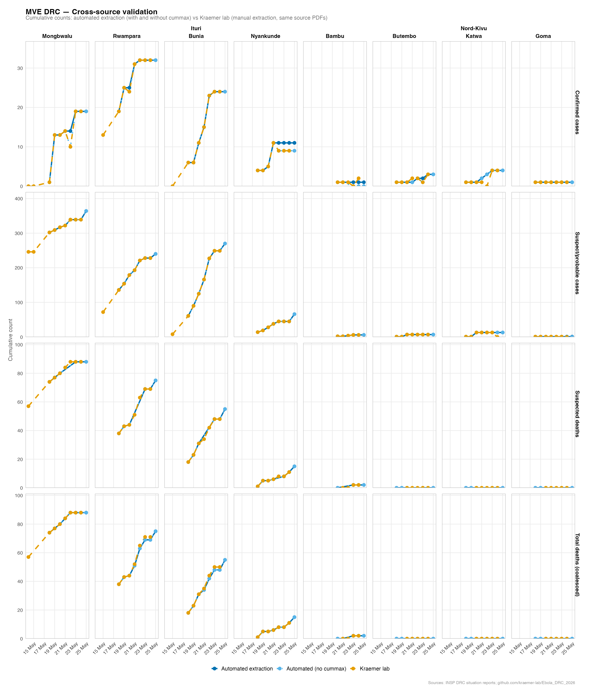

# SitRep BVD DRC — Extraction Pipeline

> AI-assisted development: this pipeline and report were developed with GitHub Copilot and the Anthropic Claude API (`claude-sonnet-4-6`), with human review.

Extracts key epidemiological tables from INSP DRC Ebola SitRep PDFs with Claude, then builds standardised CSV outputs and an HTML report, including [cross-source validation against Kraemer Lab manual extraction](https://bquilty25.github.io/bvd_sitrep_extractor/sitrep_report.html#cross-source-validation) (local fallback: [outputs/sitrep_report.html](outputs/sitrep_report.html#cross-source-validation)).



*Figure: Cross-source validation of cumulative confirmed cases, suspect/probable cases, and outbreak deaths by health zone, comparing automated extraction with Kraemer Lab manual extraction.*

Author: Billy J Quilty (Charite Berlin, LSHTM & MSF Epicentre)

## Quick Start

Prerequisites:
- Python 3.10+
- R (for report generation)
- Quarto CLI (for rendering HTML report)
- Anthropic API key

Setup:

```bash
python3 -m venv .venv
source .venv/bin/activate
pip install -r requirements.txt
cp .env.example .env
```

Add your key to `.env` (`ANTHROPIC_API_KEY` or `CLAUDE_API_KEY`).

## Daily Workflow

```bash
source .env
python3 scripts/fetch_sitreps.py
python3 scripts/extract_sitrep.py --update
```

What this does:
- Downloads new SitRep PDFs to `pdfs/`
- Skips already processed files using `outputs/processed.json`
- Appends new rows to `outputs/master_combined_counts.csv`

## Other Common Commands

Single PDF:

```bash
source .env
python3 scripts/extract_sitrep.py path/to/SitRep.pdf
```

Batch PDFs:

```bash
python3 scripts/extract_sitrep.py SitRep_001.pdf SitRep_002.pdf SitRep_006.pdf
```

Render report:

```bash
quarto render sitrep_report.qmd
```

Run tests:

```bash
pytest tests/ -v
```

## Outputs

Per SitRep (`outputs/sitreps/<sitrep_name>/`):
- `new_cases_counts.csv`
- `cumulative_counts.csv`
- `combined_counts.csv`
- `raw_extraction.json`

Master files (`outputs/`):
- `master_combined_counts.csv`
- `master_response_counts.csv`
- `master_poe_counts.csv`
- `processed.json`
- `sitrep_report.html`

PDF archive:
- `pdfs/` (gitignored)
- `pdfs/manifest.json`

## Core Configuration

- `ANTHROPIC_API_KEY` (preferred)
- `CLAUDE_API_KEY` (fallback)
- `ANTHROPIC_MODEL` (optional, default: `claude-sonnet-4-6`)

## Notes

- `count_type` values in combined tables are `Nouveaux` and `Cumules`.
- `ND` values from source PDFs are stored as blanks.
- Subtotals/totals are preserved when present in source tables.

## Experimental: GitHub Copilot Agent Mode

> **This feature is experimental.** It requires VS Code with GitHub Copilot and the `agent` chat mode.

The pipeline can be orchestrated end-to-end via a custom GitHub Copilot agent defined in [`.github/agents/sitrep-orchestrator.agent.md`](.github/agents/sitrep-orchestrator.agent.md). The agent calls the same underlying scripts but handles fetch, extract, Kraemer submodule update, render, and deploy autonomously — with reactive error diagnosis at each stage.

**Setup:** no additional installation is required beyond the standard prerequisites above. The agent uses the skills in `.github/skills/` for domain-specific guidance.

**Usage:** open GitHub Copilot Chat in VS Code, switch to **Agent** mode, select `sitrep-orchestrator`, and send a prompt such as:

```
check for updates
run full pipeline
render report
extract latest sitreps
```

The agent runs `fetch_sitreps.py`, `extract_sitrep.py --update`, updates the Kraemer submodule, renders the Quarto report, and pushes to `origin/main` — prompting you before any destructive step.

## License

MIT. See [LICENSE](LICENSE).
