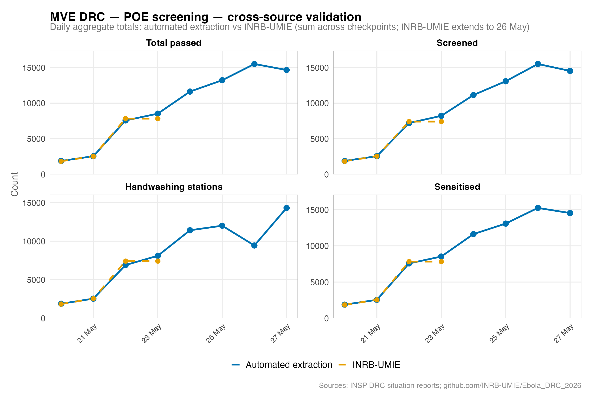
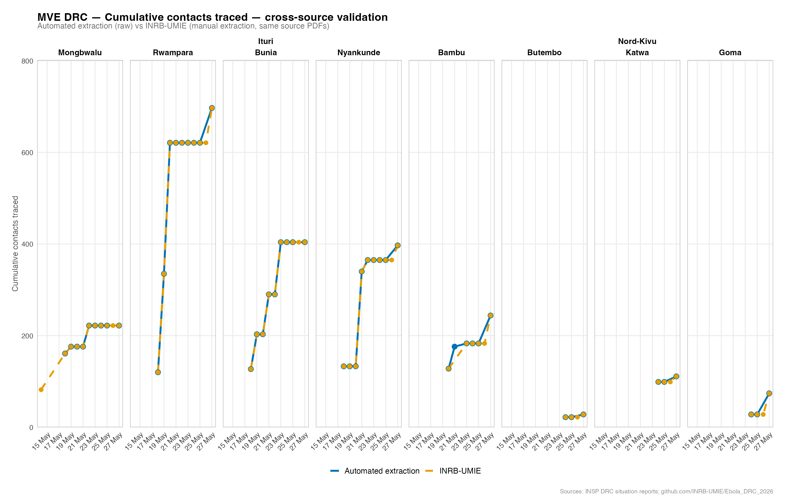

::: {.cell}

:::


::: {.cell}

:::


::: {.cell}

:::


::: {.cell}

:::


::: {.callout-warning}
**Automated extraction — verification required.**
Case counts and figures in this report are extracted from INSP DRC PDF situation reports by an AI vision model (Anthropic Claude `claude-sonnet-4-6`) without systematic manual verification of every value. Extraction errors are possible, particularly where PDF table layouts are complex or inconsistent. All values should be verified against the [original INSP DRC situation reports](https://insp.cd/ebola/) before any operational, clinical, or policy use. This report is intended for research and situational awareness only.
:::

## Introduction

This report summarises the 2026 Ebola (MVE) outbreak in the Democratic Republic of Congo, covering cases in Ituri and Nord-Kivu provinces. Data are drawn from official situation reports published by the Institut National de Santé Publique (INSP DRC) and are updated automatically as new reports become available.

## Methods

### Data sources

Case counts were taken from the INSP DRC situation report PDFs, downloaded automatically from <https://insp.cd/ebola/>. We verified that our copies of each PDF are identical to those used by INRB-UMIE (by comparing file checksums), so any differences between the two datasets come from how the tables were read, not which documents were used. The INRB-UMIE series, produced by manual data entry, was used as an independent check on our automated extraction.

### Automated PDF extraction

Each PDF was read by Claude (Anthropic, `claude-sonnet-4-6`), which looks at the page visually — the same way a person would — rather than relying on the underlying text. This allows it to handle the complex table layouts in the situation reports accurately. From each PDF we extract four things: daily new case counts, cumulative case and death totals, patient movement through isolation units (available from SitRep 006 onwards), and Point of Entry screening activity. A full text transcript of each report is also saved for audit purposes.

### Data harmonisation

Health zone names were standardised to a consistent spelling across all reports. Suspected and probable case counts were added together into a single "unconfirmed" category, since different reports label these columns differently. Cumulative totals were not allowed to decrease over time (a count cannot go backwards), and where more than one row existed for the same zone and date, the higher value was kept.

### Statistical analysis

All analysis and figures were produced in R (version 4.5.1) using the `tidyverse` [@tidyverse], `ggplot2` [@ggplot2], and `flextable` [@flextable] packages. This report was rendered automatically with Quarto.

## Results

As of 27 May 2026, the DRC MVE outbreak had recorded a cumulative total of 1,031 cases (125 confirmed, 906 suspect or probable) and 238 deaths, corresponding to a case fatality ratio of 23.1%. Cases have been reported across 8 health zones in 2 provinces.

### Cumulative epidemic curve


::: {.cell}
::: {.cell-output-display}
{#fig-cumulative width=768}
:::
:::


### Daily new cases


::: {.cell}
::: {.cell-output-display}
{#fig-new-cases width=672}
:::
:::


### Geographic distribution — cumulative counts


::: {.cell}
::: {.cell-output-display}
{#fig-zone-cumulative width=960}
:::
:::


### Geographic distribution — new cases


::: {.cell}
::: {.cell-output-display}
{#fig-zone-new width=960}
:::
:::


### Current counts by health zone

Table 1 presents the most recent cumulative case counts disaggregated by health zone, drawn from the latest available situation report for each zone.


::: {#tbl-zones .cell tbl-cap='Table 1. Latest cumulative case counts by health zone.'}
::: {.cell-output-display}

```{=html}
<div class="tabwid"><style>.cl-dd2ce824{}.cl-dd2938aa{font-family:'Arial';font-size:10pt;font-weight:bold;font-style:normal;text-decoration:none;color:rgba(255, 255, 255, 1.00);background-color:transparent;}.cl-dd2938b4{font-family:'Arial';font-size:10pt;font-weight:normal;font-style:normal;text-decoration:none;color:rgba(0, 0, 0, 1.00);background-color:transparent;}.cl-dd2938be{font-family:'Arial';font-size:10pt;font-weight:bold;font-style:normal;text-decoration:none;color:rgba(0, 0, 0, 1.00);background-color:transparent;}.cl-dd2a6482{margin:0;text-align:left;border-bottom: 0 solid rgba(0, 0, 0, 1.00);border-top: 0 solid rgba(0, 0, 0, 1.00);border-left: 0 solid rgba(0, 0, 0, 1.00);border-right: 0 solid rgba(0, 0, 0, 1.00);padding-bottom:5pt;padding-top:5pt;padding-left:5pt;padding-right:5pt;line-height: 1;background-color:transparent;}.cl-dd2a6483{margin:0;text-align:right;border-bottom: 0 solid rgba(0, 0, 0, 1.00);border-top: 0 solid rgba(0, 0, 0, 1.00);border-left: 0 solid rgba(0, 0, 0, 1.00);border-right: 0 solid rgba(0, 0, 0, 1.00);padding-bottom:5pt;padding-top:5pt;padding-left:5pt;padding-right:5pt;line-height: 1;background-color:transparent;}.cl-dd2a736e{width:1.065in;background-color:rgba(26, 58, 92, 1.00);vertical-align: middle;border-bottom: 1.5pt solid rgba(204, 204, 204, 1.00);border-top: 1.5pt solid rgba(204, 204, 204, 1.00);border-left: 0 solid rgba(0, 0, 0, 1.00);border-right: 0 solid rgba(0, 0, 0, 1.00);margin-bottom:0;margin-top:0;margin-left:0;margin-right:0;}.cl-dd2a736f{width:0.903in;background-color:rgba(26, 58, 92, 1.00);vertical-align: middle;border-bottom: 1.5pt solid rgba(204, 204, 204, 1.00);border-top: 1.5pt solid rgba(204, 204, 204, 1.00);border-left: 0 solid rgba(0, 0, 0, 1.00);border-right: 0 solid rgba(0, 0, 0, 1.00);margin-bottom:0;margin-top:0;margin-left:0;margin-right:0;}.cl-dd2a7370{width:1.111in;background-color:rgba(26, 58, 92, 1.00);vertical-align: middle;border-bottom: 1.5pt solid rgba(204, 204, 204, 1.00);border-top: 1.5pt solid rgba(204, 204, 204, 1.00);border-left: 0 solid rgba(0, 0, 0, 1.00);border-right: 0 solid rgba(0, 0, 0, 1.00);margin-bottom:0;margin-top:0;margin-left:0;margin-right:0;}.cl-dd2a7378{width:1.451in;background-color:rgba(26, 58, 92, 1.00);vertical-align: middle;border-bottom: 1.5pt solid rgba(204, 204, 204, 1.00);border-top: 1.5pt solid rgba(204, 204, 204, 1.00);border-left: 0 solid rgba(0, 0, 0, 1.00);border-right: 0 solid rgba(0, 0, 0, 1.00);margin-bottom:0;margin-top:0;margin-left:0;margin-right:0;}.cl-dd2a7379{width:0.98in;background-color:rgba(26, 58, 92, 1.00);vertical-align: middle;border-bottom: 1.5pt solid rgba(204, 204, 204, 1.00);border-top: 1.5pt solid rgba(204, 204, 204, 1.00);border-left: 0 solid rgba(0, 0, 0, 1.00);border-right: 0 solid rgba(0, 0, 0, 1.00);margin-bottom:0;margin-top:0;margin-left:0;margin-right:0;}.cl-dd2a737a{width:0.748in;background-color:rgba(26, 58, 92, 1.00);vertical-align: middle;border-bottom: 1.5pt solid rgba(204, 204, 204, 1.00);border-top: 1.5pt solid rgba(204, 204, 204, 1.00);border-left: 0 solid rgba(0, 0, 0, 1.00);border-right: 0 solid rgba(0, 0, 0, 1.00);margin-bottom:0;margin-top:0;margin-left:0;margin-right:0;}.cl-dd2a737b{width:1.065in;background-color:transparent;vertical-align: middle;border-bottom: 0 solid rgba(0, 0, 0, 1.00);border-top: 0 solid rgba(0, 0, 0, 1.00);border-left: 0 solid rgba(0, 0, 0, 1.00);border-right: 0 solid rgba(0, 0, 0, 1.00);margin-bottom:0;margin-top:0;margin-left:0;margin-right:0;}.cl-dd2a7382{width:0.903in;background-color:transparent;vertical-align: middle;border-bottom: 0 solid rgba(0, 0, 0, 1.00);border-top: 0 solid rgba(0, 0, 0, 1.00);border-left: 0 solid rgba(0, 0, 0, 1.00);border-right: 0 solid rgba(0, 0, 0, 1.00);margin-bottom:0;margin-top:0;margin-left:0;margin-right:0;}.cl-dd2a7383{width:1.111in;background-color:transparent;vertical-align: middle;border-bottom: 0 solid rgba(0, 0, 0, 1.00);border-top: 0 solid rgba(0, 0, 0, 1.00);border-left: 0 solid rgba(0, 0, 0, 1.00);border-right: 0 solid rgba(0, 0, 0, 1.00);margin-bottom:0;margin-top:0;margin-left:0;margin-right:0;}.cl-dd2a7384{width:1.451in;background-color:transparent;vertical-align: middle;border-bottom: 0 solid rgba(0, 0, 0, 1.00);border-top: 0 solid rgba(0, 0, 0, 1.00);border-left: 0 solid rgba(0, 0, 0, 1.00);border-right: 0 solid rgba(0, 0, 0, 1.00);margin-bottom:0;margin-top:0;margin-left:0;margin-right:0;}.cl-dd2a7385{width:0.98in;background-color:transparent;vertical-align: middle;border-bottom: 0 solid rgba(0, 0, 0, 1.00);border-top: 0 solid rgba(0, 0, 0, 1.00);border-left: 0 solid rgba(0, 0, 0, 1.00);border-right: 0 solid rgba(0, 0, 0, 1.00);margin-bottom:0;margin-top:0;margin-left:0;margin-right:0;}.cl-dd2a738c{width:0.748in;background-color:transparent;vertical-align: middle;border-bottom: 0 solid rgba(0, 0, 0, 1.00);border-top: 0 solid rgba(0, 0, 0, 1.00);border-left: 0 solid rgba(0, 0, 0, 1.00);border-right: 0 solid rgba(0, 0, 0, 1.00);margin-bottom:0;margin-top:0;margin-left:0;margin-right:0;}.cl-dd2a738d{width:1.065in;background-color:transparent;vertical-align: middle;border-bottom: 1pt solid rgba(204, 204, 204, 1.00);border-top: 0 solid rgba(0, 0, 0, 1.00);border-left: 0 solid rgba(0, 0, 0, 1.00);border-right: 0 solid rgba(0, 0, 0, 1.00);margin-bottom:0;margin-top:0;margin-left:0;margin-right:0;}.cl-dd2a738e{width:0.903in;background-color:transparent;vertical-align: middle;border-bottom: 1pt solid rgba(204, 204, 204, 1.00);border-top: 0 solid rgba(0, 0, 0, 1.00);border-left: 0 solid rgba(0, 0, 0, 1.00);border-right: 0 solid rgba(0, 0, 0, 1.00);margin-bottom:0;margin-top:0;margin-left:0;margin-right:0;}.cl-dd2a738f{width:1.111in;background-color:transparent;vertical-align: middle;border-bottom: 1pt solid rgba(204, 204, 204, 1.00);border-top: 0 solid rgba(0, 0, 0, 1.00);border-left: 0 solid rgba(0, 0, 0, 1.00);border-right: 0 solid rgba(0, 0, 0, 1.00);margin-bottom:0;margin-top:0;margin-left:0;margin-right:0;}.cl-dd2a7390{width:1.451in;background-color:transparent;vertical-align: middle;border-bottom: 1pt solid rgba(204, 204, 204, 1.00);border-top: 0 solid rgba(0, 0, 0, 1.00);border-left: 0 solid rgba(0, 0, 0, 1.00);border-right: 0 solid rgba(0, 0, 0, 1.00);margin-bottom:0;margin-top:0;margin-left:0;margin-right:0;}.cl-dd2a7391{width:0.98in;background-color:transparent;vertical-align: middle;border-bottom: 1pt solid rgba(204, 204, 204, 1.00);border-top: 0 solid rgba(0, 0, 0, 1.00);border-left: 0 solid rgba(0, 0, 0, 1.00);border-right: 0 solid rgba(0, 0, 0, 1.00);margin-bottom:0;margin-top:0;margin-left:0;margin-right:0;}.cl-dd2a7392{width:0.748in;background-color:transparent;vertical-align: middle;border-bottom: 1pt solid rgba(204, 204, 204, 1.00);border-top: 0 solid rgba(0, 0, 0, 1.00);border-left: 0 solid rgba(0, 0, 0, 1.00);border-right: 0 solid rgba(0, 0, 0, 1.00);margin-bottom:0;margin-top:0;margin-left:0;margin-right:0;}.cl-dd2a7396{width:1.065in;background-color:rgba(232, 239, 247, 1.00);vertical-align: middle;border-bottom: 1.5pt solid rgba(204, 204, 204, 1.00);border-top: 1pt solid rgba(204, 204, 204, 1.00);border-left: 0 solid rgba(0, 0, 0, 1.00);border-right: 0 solid rgba(0, 0, 0, 1.00);margin-bottom:0;margin-top:0;margin-left:0;margin-right:0;}.cl-dd2a7397{width:0.903in;background-color:rgba(232, 239, 247, 1.00);vertical-align: middle;border-bottom: 1.5pt solid rgba(204, 204, 204, 1.00);border-top: 1pt solid rgba(204, 204, 204, 1.00);border-left: 0 solid rgba(0, 0, 0, 1.00);border-right: 0 solid rgba(0, 0, 0, 1.00);margin-bottom:0;margin-top:0;margin-left:0;margin-right:0;}.cl-dd2a7398{width:1.111in;background-color:rgba(232, 239, 247, 1.00);vertical-align: middle;border-bottom: 1.5pt solid rgba(204, 204, 204, 1.00);border-top: 1pt solid rgba(204, 204, 204, 1.00);border-left: 0 solid rgba(0, 0, 0, 1.00);border-right: 0 solid rgba(0, 0, 0, 1.00);margin-bottom:0;margin-top:0;margin-left:0;margin-right:0;}.cl-dd2a73a0{width:1.451in;background-color:rgba(232, 239, 247, 1.00);vertical-align: middle;border-bottom: 1.5pt solid rgba(204, 204, 204, 1.00);border-top: 1pt solid rgba(204, 204, 204, 1.00);border-left: 0 solid rgba(0, 0, 0, 1.00);border-right: 0 solid rgba(0, 0, 0, 1.00);margin-bottom:0;margin-top:0;margin-left:0;margin-right:0;}.cl-dd2a73a1{width:0.98in;background-color:rgba(232, 239, 247, 1.00);vertical-align: middle;border-bottom: 1.5pt solid rgba(204, 204, 204, 1.00);border-top: 1pt solid rgba(204, 204, 204, 1.00);border-left: 0 solid rgba(0, 0, 0, 1.00);border-right: 0 solid rgba(0, 0, 0, 1.00);margin-bottom:0;margin-top:0;margin-left:0;margin-right:0;}.cl-dd2a73aa{width:0.748in;background-color:rgba(232, 239, 247, 1.00);vertical-align: middle;border-bottom: 1.5pt solid rgba(204, 204, 204, 1.00);border-top: 1pt solid rgba(204, 204, 204, 1.00);border-left: 0 solid rgba(0, 0, 0, 1.00);border-right: 0 solid rgba(0, 0, 0, 1.00);margin-bottom:0;margin-top:0;margin-left:0;margin-right:0;}</style><table data-quarto-disable-processing='true' class='cl-dd2ce824'><thead><tr style="overflow-wrap:break-word;"><th class="cl-dd2a736e"><p class="cl-dd2a6482"><span class="cl-dd2938aa">Health zone</span></p></th><th class="cl-dd2a736f"><p class="cl-dd2a6482"><span class="cl-dd2938aa">Province</span></p></th><th class="cl-dd2a7370"><p class="cl-dd2a6482"><span class="cl-dd2938aa">Latest sitrep</span></p></th><th class="cl-dd2a7378"><p class="cl-dd2a6483"><span class="cl-dd2938aa">Suspect/probable</span></p></th><th class="cl-dd2a7379"><p class="cl-dd2a6483"><span class="cl-dd2938aa">Confirmed</span></p></th><th class="cl-dd2a737a"><p class="cl-dd2a6483"><span class="cl-dd2938aa">Deaths</span></p></th></tr></thead><tbody><tr style="overflow-wrap:break-word;"><td class="cl-dd2a737b"><p class="cl-dd2a6482"><span class="cl-dd2938b4">Mongbwalu</span></p></td><td class="cl-dd2a7382"><p class="cl-dd2a6482"><span class="cl-dd2938b4">Ituri</span></p></td><td class="cl-dd2a7383"><p class="cl-dd2a6482"><span class="cl-dd2938b4">27 May 2026</span></p></td><td class="cl-dd2a7384"><p class="cl-dd2a6483"><span class="cl-dd2938b4">364</span></p></td><td class="cl-dd2a7385"><p class="cl-dd2a6483"><span class="cl-dd2938b4">20</span></p></td><td class="cl-dd2a738c"><p class="cl-dd2a6483"><span class="cl-dd2938b4">88</span></p></td></tr><tr style="overflow-wrap:break-word;"><td class="cl-dd2a737b"><p class="cl-dd2a6482"><span class="cl-dd2938b4">Rwampara</span></p></td><td class="cl-dd2a7382"><p class="cl-dd2a6482"><span class="cl-dd2938b4">Ituri</span></p></td><td class="cl-dd2a7383"><p class="cl-dd2a6482"><span class="cl-dd2938b4">27 May 2026</span></p></td><td class="cl-dd2a7384"><p class="cl-dd2a6483"><span class="cl-dd2938b4">240</span></p></td><td class="cl-dd2a7385"><p class="cl-dd2a6483"><span class="cl-dd2938b4">33</span></p></td><td class="cl-dd2a738c"><p class="cl-dd2a6483"><span class="cl-dd2938b4">75</span></p></td></tr><tr style="overflow-wrap:break-word;"><td class="cl-dd2a737b"><p class="cl-dd2a6482"><span class="cl-dd2938b4">Bunia</span></p></td><td class="cl-dd2a7382"><p class="cl-dd2a6482"><span class="cl-dd2938b4">Ituri</span></p></td><td class="cl-dd2a7383"><p class="cl-dd2a6482"><span class="cl-dd2938b4">27 May 2026</span></p></td><td class="cl-dd2a7384"><p class="cl-dd2a6483"><span class="cl-dd2938b4">270</span></p></td><td class="cl-dd2a7385"><p class="cl-dd2a6483"><span class="cl-dd2938b4">37</span></p></td><td class="cl-dd2a738c"><p class="cl-dd2a6483"><span class="cl-dd2938b4">55</span></p></td></tr><tr style="overflow-wrap:break-word;"><td class="cl-dd2a737b"><p class="cl-dd2a6482"><span class="cl-dd2938b4">Nyankunde</span></p></td><td class="cl-dd2a7382"><p class="cl-dd2a6482"><span class="cl-dd2938b4">Ituri</span></p></td><td class="cl-dd2a7383"><p class="cl-dd2a6482"><span class="cl-dd2938b4">27 May 2026</span></p></td><td class="cl-dd2a7384"><p class="cl-dd2a6483"><span class="cl-dd2938b4">66</span></p></td><td class="cl-dd2a7385"><p class="cl-dd2a6483"><span class="cl-dd2938b4">11</span></p></td><td class="cl-dd2a738c"><p class="cl-dd2a6483"><span class="cl-dd2938b4">15</span></p></td></tr><tr style="overflow-wrap:break-word;"><td class="cl-dd2a737b"><p class="cl-dd2a6482"><span class="cl-dd2938b4">Bambu</span></p></td><td class="cl-dd2a7382"><p class="cl-dd2a6482"><span class="cl-dd2938b4">Ituri</span></p></td><td class="cl-dd2a7383"><p class="cl-dd2a6482"><span class="cl-dd2938b4">27 May 2026</span></p></td><td class="cl-dd2a7384"><p class="cl-dd2a6483"><span class="cl-dd2938b4">6</span></p></td><td class="cl-dd2a7385"><p class="cl-dd2a6483"><span class="cl-dd2938b4">1</span></p></td><td class="cl-dd2a738c"><p class="cl-dd2a6483"><span class="cl-dd2938b4">2</span></p></td></tr><tr style="overflow-wrap:break-word;"><td class="cl-dd2a737b"><p class="cl-dd2a6482"><span class="cl-dd2938b4">Butembo</span></p></td><td class="cl-dd2a7382"><p class="cl-dd2a6482"><span class="cl-dd2938b4">Nord-Kivu</span></p></td><td class="cl-dd2a7383"><p class="cl-dd2a6482"><span class="cl-dd2938b4">27 May 2026</span></p></td><td class="cl-dd2a7384"><p class="cl-dd2a6483"><span class="cl-dd2938b4">7</span></p></td><td class="cl-dd2a7385"><p class="cl-dd2a6483"><span class="cl-dd2938b4">5</span></p></td><td class="cl-dd2a738c"><p class="cl-dd2a6483"><span class="cl-dd2938b4">0</span></p></td></tr><tr style="overflow-wrap:break-word;"><td class="cl-dd2a737b"><p class="cl-dd2a6482"><span class="cl-dd2938b4">Katwa</span></p></td><td class="cl-dd2a7382"><p class="cl-dd2a6482"><span class="cl-dd2938b4">Nord-Kivu</span></p></td><td class="cl-dd2a7383"><p class="cl-dd2a6482"><span class="cl-dd2938b4">27 May 2026</span></p></td><td class="cl-dd2a7384"><p class="cl-dd2a6483"><span class="cl-dd2938b4">13</span></p></td><td class="cl-dd2a7385"><p class="cl-dd2a6483"><span class="cl-dd2938b4">4</span></p></td><td class="cl-dd2a738c"><p class="cl-dd2a6483"><span class="cl-dd2938b4">0</span></p></td></tr><tr style="overflow-wrap:break-word;"><td class="cl-dd2a738d"><p class="cl-dd2a6482"><span class="cl-dd2938b4">Goma</span></p></td><td class="cl-dd2a738e"><p class="cl-dd2a6482"><span class="cl-dd2938b4">Nord-Kivu</span></p></td><td class="cl-dd2a738f"><p class="cl-dd2a6482"><span class="cl-dd2938b4">27 May 2026</span></p></td><td class="cl-dd2a7390"><p class="cl-dd2a6483"><span class="cl-dd2938b4">1</span></p></td><td class="cl-dd2a7391"><p class="cl-dd2a6483"><span class="cl-dd2938b4">1</span></p></td><td class="cl-dd2a7392"><p class="cl-dd2a6483"><span class="cl-dd2938b4">0</span></p></td></tr><tr style="overflow-wrap:break-word;"><td class="cl-dd2a7396"><p class="cl-dd2a6482"><span class="cl-dd2938be">Total</span></p></td><td class="cl-dd2a7397"><p class="cl-dd2a6482"><span class="cl-dd2938be">—</span></p></td><td class="cl-dd2a7398"><p class="cl-dd2a6482"><span class="cl-dd2938be">27 May 2026</span></p></td><td class="cl-dd2a73a0"><p class="cl-dd2a6483"><span class="cl-dd2938be">967</span></p></td><td class="cl-dd2a73a1"><p class="cl-dd2a6483"><span class="cl-dd2938be">112</span></p></td><td class="cl-dd2a73aa"><p class="cl-dd2a6483"><span class="cl-dd2938be">235</span></p></td></tr></tbody></table></div>
```

:::
:::


### Cross-source validation

We checked our automated extraction against the [INRB-UMIE Ebola DRC 2026](https://github.com/INRB-UMIE/Ebola_DRC_2026) manually coded dataset. For SitReps 1–11, both datasets work from the same PDF files, so any differences between them reflect how the tables were read rather than which documents were used. From SitRep 12 onwards, INRB-UMIE received health-zone tables directly from INRB via WhatsApp; these may not correspond exactly to the figures published in each PDF. Two zone name variants between the datasets (Mongbwalu/Mongbalu and Nyankunde/Nyakunde) were matched manually. Values marked "ND" (not available) were treated as missing.

#### National-level comparison — this repo, BVDOutbreakSize, and INRB-UMIE

At the national level, cumulative suspected and confirmed case counts agree exactly across all three sources for every date in the overlap period. The only divergences are in the deaths series.

From SitRep 10 onwards, INSP's front-page banner figures and the per-health-zone sub-tables frequently report different national totals. INRB-UMIE tracks both separately: files named `national_*` contain the banner figures, which represent INSP's official national position; files without `national` in the name contain the zone-level sub-table values. This repo also reads from the front-page banner. BVDOutbreakSize, by contrast, derives national totals by summing the per-zone rows. The disagreement between these approaches therefore reflects a structural feature of the source documents — INSP's own banner and sub-tables often disagree — rather than an error in either dataset.

On 23 May (SitRep 009), this repo and the INRB-UMIE national figure both record 119 suspected deaths, matching the front-page banner. [BVDOutbreakSize](https://github.com/epiforecasts/BVDOutbreakSize/pull/140) (PR \#140) records 220, which is the per-zone row sum. Both values are internally consistent with their respective source tables. On 26 May (SitRep 012), both a first and a revised version of the PDF were processed. The original extraction (SitRep\_012) records 238 deaths (matching BVDOutbreakSize), while the revised extraction (SitRep\_012\_v2) records 246 deaths; there was no per-zone case table in this report against which to cross-check the banner figure. The INRB-UMIE national snapshot currently covers 27 May only (back-filling to SitRep 10 is in progress); on that date their banner-derived figures are 906 suspected cases, 223 suspected deaths, and 17 confirmed deaths, consistent with this repo.


::: {#tbl-national-comparison .cell tbl-cap='National cumulative totals — cross-source comparison. Shading indicates values that differ across sources. BVD: BVDOutbreakSize (epiforecasts/BVDOutbreakSize PR \#140); INRB-UMIE: INRB-UMIE/Ebola DRC 2026. A dash indicates no data available from that source for that date.'}
::: {.cell-output-display}

```{=html}
<div class="tabwid"><style>.cl-dd41915c{}.cl-dd3e0014{font-family:'Arial';font-size:10pt;font-weight:bold;font-style:normal;text-decoration:none;color:rgba(0, 0, 0, 1.00);background-color:transparent;}.cl-dd3e001e{font-family:'Arial';font-size:10pt;font-weight:normal;font-style:normal;text-decoration:none;color:rgba(0, 0, 0, 1.00);background-color:transparent;}.cl-dd3f406e{margin:0;text-align:center;border-bottom: 0 solid rgba(0, 0, 0, 1.00);border-top: 0 solid rgba(0, 0, 0, 1.00);border-left: 0 solid rgba(0, 0, 0, 1.00);border-right: 0 solid rgba(0, 0, 0, 1.00);padding-bottom:5pt;padding-top:5pt;padding-left:5pt;padding-right:5pt;line-height: 1;background-color:transparent;}.cl-dd3f406f{margin:0;text-align:left;border-bottom: 0 solid rgba(0, 0, 0, 1.00);border-top: 0 solid rgba(0, 0, 0, 1.00);border-left: 0 solid rgba(0, 0, 0, 1.00);border-right: 0 solid rgba(0, 0, 0, 1.00);padding-bottom:5pt;padding-top:5pt;padding-left:5pt;padding-right:5pt;line-height: 1;background-color:transparent;}.cl-dd3f4078{margin:0;text-align:right;border-bottom: 0 solid rgba(0, 0, 0, 1.00);border-top: 0 solid rgba(0, 0, 0, 1.00);border-left: 0 solid rgba(0, 0, 0, 1.00);border-right: 0 solid rgba(0, 0, 0, 1.00);padding-bottom:5pt;padding-top:5pt;padding-left:5pt;padding-right:5pt;line-height: 1;background-color:transparent;}.cl-dd3fb846{width:0.741in;background-color:transparent;vertical-align: middle;border-bottom: 1.5pt solid rgba(204, 204, 204, 1.00);border-top: 1.5pt solid rgba(204, 204, 204, 1.00);border-left: 0 solid rgba(0, 0, 0, 1.00);border-right: 0 solid rgba(0, 0, 0, 1.00);margin-bottom:0;margin-top:0;margin-left:0;margin-right:0;}.cl-dd3fb850{width:1.296in;background-color:transparent;vertical-align: middle;border-bottom: 1.5pt solid rgba(204, 204, 204, 1.00);border-top: 1.5pt solid rgba(204, 204, 204, 1.00);border-left: 0 solid rgba(0, 0, 0, 1.00);border-right: 0 solid rgba(0, 0, 0, 1.00);margin-bottom:0;margin-top:0;margin-left:0;margin-right:0;}.cl-dd3fb851{width:1.288in;background-color:transparent;vertical-align: middle;border-bottom: 1.5pt solid rgba(204, 204, 204, 1.00);border-top: 1.5pt solid rgba(204, 204, 204, 1.00);border-left: 0 solid rgba(0, 0, 0, 1.00);border-right: 0 solid rgba(0, 0, 0, 1.00);margin-bottom:0;margin-top:0;margin-left:0;margin-right:0;}.cl-dd3fb852{width:1.728in;background-color:transparent;vertical-align: middle;border-bottom: 1.5pt solid rgba(204, 204, 204, 1.00);border-top: 1.5pt solid rgba(204, 204, 204, 1.00);border-left: 0 solid rgba(0, 0, 0, 1.00);border-right: 0 solid rgba(0, 0, 0, 1.00);margin-bottom:0;margin-top:0;margin-left:0;margin-right:0;}.cl-dd3fb853{width:1.412in;background-color:transparent;vertical-align: middle;border-bottom: 1.5pt solid rgba(204, 204, 204, 1.00);border-top: 1.5pt solid rgba(204, 204, 204, 1.00);border-left: 0 solid rgba(0, 0, 0, 1.00);border-right: 0 solid rgba(0, 0, 0, 1.00);margin-bottom:0;margin-top:0;margin-left:0;margin-right:0;}.cl-dd3fb85a{width:1.404in;background-color:transparent;vertical-align: middle;border-bottom: 1.5pt solid rgba(204, 204, 204, 1.00);border-top: 1.5pt solid rgba(204, 204, 204, 1.00);border-left: 0 solid rgba(0, 0, 0, 1.00);border-right: 0 solid rgba(0, 0, 0, 1.00);margin-bottom:0;margin-top:0;margin-left:0;margin-right:0;}.cl-dd3fb85b{width:1.844in;background-color:transparent;vertical-align: middle;border-bottom: 1.5pt solid rgba(204, 204, 204, 1.00);border-top: 1.5pt solid rgba(204, 204, 204, 1.00);border-left: 0 solid rgba(0, 0, 0, 1.00);border-right: 0 solid rgba(0, 0, 0, 1.00);margin-bottom:0;margin-top:0;margin-left:0;margin-right:0;}.cl-dd3fb85c{width:1.18in;background-color:transparent;vertical-align: middle;border-bottom: 1.5pt solid rgba(204, 204, 204, 1.00);border-top: 1.5pt solid rgba(204, 204, 204, 1.00);border-left: 0 solid rgba(0, 0, 0, 1.00);border-right: 0 solid rgba(0, 0, 0, 1.00);margin-bottom:0;margin-top:0;margin-left:0;margin-right:0;}.cl-dd3fb85d{width:1.173in;background-color:transparent;vertical-align: middle;border-bottom: 1.5pt solid rgba(204, 204, 204, 1.00);border-top: 1.5pt solid rgba(204, 204, 204, 1.00);border-left: 0 solid rgba(0, 0, 0, 1.00);border-right: 0 solid rgba(0, 0, 0, 1.00);margin-bottom:0;margin-top:0;margin-left:0;margin-right:0;}.cl-dd3fb85e{width:2.014in;background-color:transparent;vertical-align: middle;border-bottom: 1.5pt solid rgba(204, 204, 204, 1.00);border-top: 1.5pt solid rgba(204, 204, 204, 1.00);border-left: 0 solid rgba(0, 0, 0, 1.00);border-right: 0 solid rgba(0, 0, 0, 1.00);margin-bottom:0;margin-top:0;margin-left:0;margin-right:0;}.cl-dd3fb85f{width:1.983in;background-color:transparent;vertical-align: middle;border-bottom: 1.5pt solid rgba(204, 204, 204, 1.00);border-top: 1.5pt solid rgba(204, 204, 204, 1.00);border-left: 0 solid rgba(0, 0, 0, 1.00);border-right: 0 solid rgba(0, 0, 0, 1.00);margin-bottom:0;margin-top:0;margin-left:0;margin-right:0;}.cl-dd3fb864{width:0.741in;background-color:transparent;vertical-align: middle;border-bottom: 1.5pt solid rgba(204, 204, 204, 1.00);border-top: 1.5pt solid rgba(204, 204, 204, 1.00);border-left: 0 solid rgba(0, 0, 0, 1.00);border-right: 0 solid rgba(0, 0, 0, 1.00);margin-bottom:0;margin-top:0;margin-left:0;margin-right:0;}.cl-dd3fb865{width:1.296in;background-color:transparent;vertical-align: middle;border-bottom: 1.5pt solid rgba(204, 204, 204, 1.00);border-top: 1.5pt solid rgba(204, 204, 204, 1.00);border-left: 0 solid rgba(0, 0, 0, 1.00);border-right: 0 solid rgba(0, 0, 0, 1.00);margin-bottom:0;margin-top:0;margin-left:0;margin-right:0;}.cl-dd3fb866{width:1.288in;background-color:transparent;vertical-align: middle;border-bottom: 1.5pt solid rgba(204, 204, 204, 1.00);border-top: 1.5pt solid rgba(204, 204, 204, 1.00);border-left: 0 solid rgba(0, 0, 0, 1.00);border-right: 0 solid rgba(0, 0, 0, 1.00);margin-bottom:0;margin-top:0;margin-left:0;margin-right:0;}.cl-dd3fb867{width:1.728in;background-color:transparent;vertical-align: middle;border-bottom: 1.5pt solid rgba(204, 204, 204, 1.00);border-top: 1.5pt solid rgba(204, 204, 204, 1.00);border-left: 0 solid rgba(0, 0, 0, 1.00);border-right: 0 solid rgba(0, 0, 0, 1.00);margin-bottom:0;margin-top:0;margin-left:0;margin-right:0;}.cl-dd3fb868{width:1.412in;background-color:transparent;vertical-align: middle;border-bottom: 1.5pt solid rgba(204, 204, 204, 1.00);border-top: 1.5pt solid rgba(204, 204, 204, 1.00);border-left: 0 solid rgba(0, 0, 0, 1.00);border-right: 0 solid rgba(0, 0, 0, 1.00);margin-bottom:0;margin-top:0;margin-left:0;margin-right:0;}.cl-dd3fb869{width:1.404in;background-color:transparent;vertical-align: middle;border-bottom: 1.5pt solid rgba(204, 204, 204, 1.00);border-top: 1.5pt solid rgba(204, 204, 204, 1.00);border-left: 0 solid rgba(0, 0, 0, 1.00);border-right: 0 solid rgba(0, 0, 0, 1.00);margin-bottom:0;margin-top:0;margin-left:0;margin-right:0;}.cl-dd3fb86a{width:1.844in;background-color:transparent;vertical-align: middle;border-bottom: 1.5pt solid rgba(204, 204, 204, 1.00);border-top: 1.5pt solid rgba(204, 204, 204, 1.00);border-left: 0 solid rgba(0, 0, 0, 1.00);border-right: 0 solid rgba(0, 0, 0, 1.00);margin-bottom:0;margin-top:0;margin-left:0;margin-right:0;}.cl-dd3fb86e{width:1.18in;background-color:transparent;vertical-align: middle;border-bottom: 1.5pt solid rgba(204, 204, 204, 1.00);border-top: 1.5pt solid rgba(204, 204, 204, 1.00);border-left: 0 solid rgba(0, 0, 0, 1.00);border-right: 0 solid rgba(0, 0, 0, 1.00);margin-bottom:0;margin-top:0;margin-left:0;margin-right:0;}.cl-dd3fb86f{width:1.173in;background-color:transparent;vertical-align: middle;border-bottom: 1.5pt solid rgba(204, 204, 204, 1.00);border-top: 1.5pt solid rgba(204, 204, 204, 1.00);border-left: 0 solid rgba(0, 0, 0, 1.00);border-right: 0 solid rgba(0, 0, 0, 1.00);margin-bottom:0;margin-top:0;margin-left:0;margin-right:0;}.cl-dd3fb870{width:2.014in;background-color:transparent;vertical-align: middle;border-bottom: 1.5pt solid rgba(204, 204, 204, 1.00);border-top: 1.5pt solid rgba(204, 204, 204, 1.00);border-left: 0 solid rgba(0, 0, 0, 1.00);border-right: 0 solid rgba(0, 0, 0, 1.00);margin-bottom:0;margin-top:0;margin-left:0;margin-right:0;}.cl-dd3fb871{width:1.983in;background-color:transparent;vertical-align: middle;border-bottom: 1.5pt solid rgba(204, 204, 204, 1.00);border-top: 1.5pt solid rgba(204, 204, 204, 1.00);border-left: 0 solid rgba(0, 0, 0, 1.00);border-right: 0 solid rgba(0, 0, 0, 1.00);margin-bottom:0;margin-top:0;margin-left:0;margin-right:0;}.cl-dd3fb872{width:0.741in;background-color:transparent;vertical-align: middle;border-bottom: 1pt solid rgba(204, 204, 204, 1.00);border-top: 0 solid rgba(0, 0, 0, 1.00);border-left: 0 solid rgba(0, 0, 0, 1.00);border-right: 0 solid rgba(0, 0, 0, 1.00);margin-bottom:0;margin-top:0;margin-left:0;margin-right:0;}.cl-dd3fb873{width:1.296in;background-color:transparent;vertical-align: middle;border-bottom: 1pt solid rgba(204, 204, 204, 1.00);border-top: 0 solid rgba(0, 0, 0, 1.00);border-left: 0 solid rgba(0, 0, 0, 1.00);border-right: 0 solid rgba(0, 0, 0, 1.00);margin-bottom:0;margin-top:0;margin-left:0;margin-right:0;}.cl-dd3fb874{width:1.288in;background-color:transparent;vertical-align: middle;border-bottom: 1pt solid rgba(204, 204, 204, 1.00);border-top: 0 solid rgba(0, 0, 0, 1.00);border-left: 0 solid rgba(0, 0, 0, 1.00);border-right: 0 solid rgba(0, 0, 0, 1.00);margin-bottom:0;margin-top:0;margin-left:0;margin-right:0;}.cl-dd3fb878{width:1.728in;background-color:transparent;vertical-align: middle;border-bottom: 1pt solid rgba(204, 204, 204, 1.00);border-top: 0 solid rgba(0, 0, 0, 1.00);border-left: 0 solid rgba(0, 0, 0, 1.00);border-right: 0 solid rgba(0, 0, 0, 1.00);margin-bottom:0;margin-top:0;margin-left:0;margin-right:0;}.cl-dd3fb879{width:1.412in;background-color:transparent;vertical-align: middle;border-bottom: 1pt solid rgba(204, 204, 204, 1.00);border-top: 0 solid rgba(0, 0, 0, 1.00);border-left: 0 solid rgba(0, 0, 0, 1.00);border-right: 0 solid rgba(0, 0, 0, 1.00);margin-bottom:0;margin-top:0;margin-left:0;margin-right:0;}.cl-dd3fb87a{width:1.404in;background-color:transparent;vertical-align: middle;border-bottom: 1pt solid rgba(204, 204, 204, 1.00);border-top: 0 solid rgba(0, 0, 0, 1.00);border-left: 0 solid rgba(0, 0, 0, 1.00);border-right: 0 solid rgba(0, 0, 0, 1.00);margin-bottom:0;margin-top:0;margin-left:0;margin-right:0;}.cl-dd3fb87b{width:1.844in;background-color:transparent;vertical-align: middle;border-bottom: 1pt solid rgba(204, 204, 204, 1.00);border-top: 0 solid rgba(0, 0, 0, 1.00);border-left: 0 solid rgba(0, 0, 0, 1.00);border-right: 0 solid rgba(0, 0, 0, 1.00);margin-bottom:0;margin-top:0;margin-left:0;margin-right:0;}.cl-dd3fb87c{width:1.18in;background-color:transparent;vertical-align: middle;border-bottom: 1pt solid rgba(204, 204, 204, 1.00);border-top: 0 solid rgba(0, 0, 0, 1.00);border-left: 0 solid rgba(0, 0, 0, 1.00);border-right: 0 solid rgba(0, 0, 0, 1.00);margin-bottom:0;margin-top:0;margin-left:0;margin-right:0;}.cl-dd3fb87d{width:1.173in;background-color:transparent;vertical-align: middle;border-bottom: 1pt solid rgba(204, 204, 204, 1.00);border-top: 0 solid rgba(0, 0, 0, 1.00);border-left: 0 solid rgba(0, 0, 0, 1.00);border-right: 0 solid rgba(0, 0, 0, 1.00);margin-bottom:0;margin-top:0;margin-left:0;margin-right:0;}.cl-dd3fb882{width:2.014in;background-color:transparent;vertical-align: middle;border-bottom: 1pt solid rgba(204, 204, 204, 1.00);border-top: 0 solid rgba(0, 0, 0, 1.00);border-left: 0 solid rgba(0, 0, 0, 1.00);border-right: 0 solid rgba(0, 0, 0, 1.00);margin-bottom:0;margin-top:0;margin-left:0;margin-right:0;}.cl-dd3fb883{width:1.983in;background-color:transparent;vertical-align: middle;border-bottom: 1pt solid rgba(204, 204, 204, 1.00);border-top: 0 solid rgba(0, 0, 0, 1.00);border-left: 0 solid rgba(0, 0, 0, 1.00);border-right: 0 solid rgba(0, 0, 0, 1.00);margin-bottom:0;margin-top:0;margin-left:0;margin-right:0;}.cl-dd3fb884{width:0.741in;background-color:transparent;vertical-align: middle;border-bottom: 1pt solid rgba(204, 204, 204, 1.00);border-top: 1pt solid rgba(204, 204, 204, 1.00);border-left: 0 solid rgba(0, 0, 0, 1.00);border-right: 0 solid rgba(0, 0, 0, 1.00);margin-bottom:0;margin-top:0;margin-left:0;margin-right:0;}.cl-dd3fb885{width:1.296in;background-color:transparent;vertical-align: middle;border-bottom: 1pt solid rgba(204, 204, 204, 1.00);border-top: 1pt solid rgba(204, 204, 204, 1.00);border-left: 0 solid rgba(0, 0, 0, 1.00);border-right: 0 solid rgba(0, 0, 0, 1.00);margin-bottom:0;margin-top:0;margin-left:0;margin-right:0;}.cl-dd3fb886{width:1.288in;background-color:transparent;vertical-align: middle;border-bottom: 1pt solid rgba(204, 204, 204, 1.00);border-top: 1pt solid rgba(204, 204, 204, 1.00);border-left: 0 solid rgba(0, 0, 0, 1.00);border-right: 0 solid rgba(0, 0, 0, 1.00);margin-bottom:0;margin-top:0;margin-left:0;margin-right:0;}.cl-dd3fb887{width:1.728in;background-color:transparent;vertical-align: middle;border-bottom: 1pt solid rgba(204, 204, 204, 1.00);border-top: 1pt solid rgba(204, 204, 204, 1.00);border-left: 0 solid rgba(0, 0, 0, 1.00);border-right: 0 solid rgba(0, 0, 0, 1.00);margin-bottom:0;margin-top:0;margin-left:0;margin-right:0;}.cl-dd3fb88c{width:1.412in;background-color:transparent;vertical-align: middle;border-bottom: 1pt solid rgba(204, 204, 204, 1.00);border-top: 1pt solid rgba(204, 204, 204, 1.00);border-left: 0 solid rgba(0, 0, 0, 1.00);border-right: 0 solid rgba(0, 0, 0, 1.00);margin-bottom:0;margin-top:0;margin-left:0;margin-right:0;}.cl-dd3fb88d{width:1.404in;background-color:transparent;vertical-align: middle;border-bottom: 1pt solid rgba(204, 204, 204, 1.00);border-top: 1pt solid rgba(204, 204, 204, 1.00);border-left: 0 solid rgba(0, 0, 0, 1.00);border-right: 0 solid rgba(0, 0, 0, 1.00);margin-bottom:0;margin-top:0;margin-left:0;margin-right:0;}.cl-dd3fb88e{width:1.844in;background-color:transparent;vertical-align: middle;border-bottom: 1pt solid rgba(204, 204, 204, 1.00);border-top: 1pt solid rgba(204, 204, 204, 1.00);border-left: 0 solid rgba(0, 0, 0, 1.00);border-right: 0 solid rgba(0, 0, 0, 1.00);margin-bottom:0;margin-top:0;margin-left:0;margin-right:0;}.cl-dd3fb88f{width:1.18in;background-color:transparent;vertical-align: middle;border-bottom: 1pt solid rgba(204, 204, 204, 1.00);border-top: 1pt solid rgba(204, 204, 204, 1.00);border-left: 0 solid rgba(0, 0, 0, 1.00);border-right: 0 solid rgba(0, 0, 0, 1.00);margin-bottom:0;margin-top:0;margin-left:0;margin-right:0;}.cl-dd3fb890{width:1.173in;background-color:transparent;vertical-align: middle;border-bottom: 1pt solid rgba(204, 204, 204, 1.00);border-top: 1pt solid rgba(204, 204, 204, 1.00);border-left: 0 solid rgba(0, 0, 0, 1.00);border-right: 0 solid rgba(0, 0, 0, 1.00);margin-bottom:0;margin-top:0;margin-left:0;margin-right:0;}.cl-dd3fb891{width:2.014in;background-color:transparent;vertical-align: middle;border-bottom: 1pt solid rgba(204, 204, 204, 1.00);border-top: 1pt solid rgba(204, 204, 204, 1.00);border-left: 0 solid rgba(0, 0, 0, 1.00);border-right: 0 solid rgba(0, 0, 0, 1.00);margin-bottom:0;margin-top:0;margin-left:0;margin-right:0;}.cl-dd3fb892{width:1.983in;background-color:transparent;vertical-align: middle;border-bottom: 1pt solid rgba(204, 204, 204, 1.00);border-top: 1pt solid rgba(204, 204, 204, 1.00);border-left: 0 solid rgba(0, 0, 0, 1.00);border-right: 0 solid rgba(0, 0, 0, 1.00);margin-bottom:0;margin-top:0;margin-left:0;margin-right:0;}.cl-dd3fb896{width:1.18in;background-color:rgba(255, 243, 205, 1.00);vertical-align: middle;border-bottom: 1pt solid rgba(204, 204, 204, 1.00);border-top: 1pt solid rgba(204, 204, 204, 1.00);border-left: 0 solid rgba(0, 0, 0, 1.00);border-right: 0 solid rgba(0, 0, 0, 1.00);margin-bottom:0;margin-top:0;margin-left:0;margin-right:0;}.cl-dd3fb897{width:1.173in;background-color:rgba(255, 243, 205, 1.00);vertical-align: middle;border-bottom: 1pt solid rgba(204, 204, 204, 1.00);border-top: 1pt solid rgba(204, 204, 204, 1.00);border-left: 0 solid rgba(0, 0, 0, 1.00);border-right: 0 solid rgba(0, 0, 0, 1.00);margin-bottom:0;margin-top:0;margin-left:0;margin-right:0;}</style><table data-quarto-disable-processing='true' class='cl-dd41915c'><thead><tr style="overflow-wrap:break-word;"><th class="cl-dd3fb846"><p class="cl-dd3f406e"><span class="cl-dd3e0014"></span></p></th><th  colspan="3"class="cl-dd3fb850"><p class="cl-dd3f406e"><span class="cl-dd3e0014">Suspected cases</span></p></th><th  colspan="3"class="cl-dd3fb853"><p class="cl-dd3f406e"><span class="cl-dd3e0014">Confirmed cases</span></p></th><th  colspan="4"class="cl-dd3fb85c"><p class="cl-dd3f406e"><span class="cl-dd3e0014">Deaths</span></p></th></tr><tr style="overflow-wrap:break-word;"><th class="cl-dd3fb864"><p class="cl-dd3f406e"><span class="cl-dd3e0014">Date</span></p></th><th class="cl-dd3fb865"><p class="cl-dd3f406e"><span class="cl-dd3e0014">Suspect. (ours)</span></p></th><th class="cl-dd3fb866"><p class="cl-dd3f406e"><span class="cl-dd3e0014">Suspect. (BVD)</span></p></th><th class="cl-dd3fb867"><p class="cl-dd3f406e"><span class="cl-dd3e0014">Suspect. (INRB-UMIE)</span></p></th><th class="cl-dd3fb868"><p class="cl-dd3f406e"><span class="cl-dd3e0014">Confirmed (ours)</span></p></th><th class="cl-dd3fb869"><p class="cl-dd3f406e"><span class="cl-dd3e0014">Confirmed (BVD)</span></p></th><th class="cl-dd3fb86a"><p class="cl-dd3f406e"><span class="cl-dd3e0014">Confirmed (INRB-UMIE)</span></p></th><th class="cl-dd3fb86e"><p class="cl-dd3f406e"><span class="cl-dd3e0014">Deaths (ours)</span></p></th><th class="cl-dd3fb86f"><p class="cl-dd3f406e"><span class="cl-dd3e0014">Deaths (BVD)</span></p></th><th class="cl-dd3fb870"><p class="cl-dd3f406e"><span class="cl-dd3e0014">Deaths susp. (INRB-UMIE)</span></p></th><th class="cl-dd3fb871"><p class="cl-dd3f406e"><span class="cl-dd3e0014">Deaths conf. (INRB-UMIE)</span></p></th></tr></thead><tbody><tr style="overflow-wrap:break-word;"><td class="cl-dd3fb872"><p class="cl-dd3f406f"><span class="cl-dd3e001e">18 May</span></p></td><td class="cl-dd3fb873"><p class="cl-dd3f4078"><span class="cl-dd3e001e">516</span></p></td><td class="cl-dd3fb874"><p class="cl-dd3f4078"><span class="cl-dd3e001e">—</span></p></td><td class="cl-dd3fb878"><p class="cl-dd3f4078"><span class="cl-dd3e001e">—</span></p></td><td class="cl-dd3fb879"><p class="cl-dd3f4078"><span class="cl-dd3e001e">33</span></p></td><td class="cl-dd3fb87a"><p class="cl-dd3f4078"><span class="cl-dd3e001e">—</span></p></td><td class="cl-dd3fb87b"><p class="cl-dd3f4078"><span class="cl-dd3e001e">—</span></p></td><td class="cl-dd3fb87c"><p class="cl-dd3f4078"><span class="cl-dd3e001e">131</span></p></td><td class="cl-dd3fb87d"><p class="cl-dd3f4078"><span class="cl-dd3e001e">—</span></p></td><td class="cl-dd3fb882"><p class="cl-dd3f4078"><span class="cl-dd3e001e">—</span></p></td><td class="cl-dd3fb883"><p class="cl-dd3f4078"><span class="cl-dd3e001e">—</span></p></td></tr><tr style="overflow-wrap:break-word;"><td class="cl-dd3fb884"><p class="cl-dd3f406f"><span class="cl-dd3e001e">19 May</span></p></td><td class="cl-dd3fb885"><p class="cl-dd3f4078"><span class="cl-dd3e001e">575</span></p></td><td class="cl-dd3fb886"><p class="cl-dd3f4078"><span class="cl-dd3e001e">—</span></p></td><td class="cl-dd3fb887"><p class="cl-dd3f4078"><span class="cl-dd3e001e">—</span></p></td><td class="cl-dd3fb88c"><p class="cl-dd3f4078"><span class="cl-dd3e001e">51</span></p></td><td class="cl-dd3fb88d"><p class="cl-dd3f4078"><span class="cl-dd3e001e">—</span></p></td><td class="cl-dd3fb88e"><p class="cl-dd3f4078"><span class="cl-dd3e001e">—</span></p></td><td class="cl-dd3fb88f"><p class="cl-dd3f4078"><span class="cl-dd3e001e">148</span></p></td><td class="cl-dd3fb890"><p class="cl-dd3f4078"><span class="cl-dd3e001e">—</span></p></td><td class="cl-dd3fb891"><p class="cl-dd3f4078"><span class="cl-dd3e001e">—</span></p></td><td class="cl-dd3fb892"><p class="cl-dd3f4078"><span class="cl-dd3e001e">—</span></p></td></tr><tr style="overflow-wrap:break-word;"><td class="cl-dd3fb884"><p class="cl-dd3f406f"><span class="cl-dd3e001e">20 May</span></p></td><td class="cl-dd3fb885"><p class="cl-dd3f4078"><span class="cl-dd3e001e">671</span></p></td><td class="cl-dd3fb886"><p class="cl-dd3f4078"><span class="cl-dd3e001e">—</span></p></td><td class="cl-dd3fb887"><p class="cl-dd3f4078"><span class="cl-dd3e001e">—</span></p></td><td class="cl-dd3fb88c"><p class="cl-dd3f4078"><span class="cl-dd3e001e">61</span></p></td><td class="cl-dd3fb88d"><p class="cl-dd3f4078"><span class="cl-dd3e001e">—</span></p></td><td class="cl-dd3fb88e"><p class="cl-dd3f4078"><span class="cl-dd3e001e">—</span></p></td><td class="cl-dd3fb88f"><p class="cl-dd3f4078"><span class="cl-dd3e001e">160</span></p></td><td class="cl-dd3fb890"><p class="cl-dd3f4078"><span class="cl-dd3e001e">—</span></p></td><td class="cl-dd3fb891"><p class="cl-dd3f4078"><span class="cl-dd3e001e">—</span></p></td><td class="cl-dd3fb892"><p class="cl-dd3f4078"><span class="cl-dd3e001e">—</span></p></td></tr><tr style="overflow-wrap:break-word;"><td class="cl-dd3fb884"><p class="cl-dd3f406f"><span class="cl-dd3e001e">21 May</span></p></td><td class="cl-dd3fb885"><p class="cl-dd3f4078"><span class="cl-dd3e001e">746</span></p></td><td class="cl-dd3fb886"><p class="cl-dd3f4078"><span class="cl-dd3e001e">—</span></p></td><td class="cl-dd3fb887"><p class="cl-dd3f4078"><span class="cl-dd3e001e">—</span></p></td><td class="cl-dd3fb88c"><p class="cl-dd3f4078"><span class="cl-dd3e001e">83</span></p></td><td class="cl-dd3fb88d"><p class="cl-dd3f4078"><span class="cl-dd3e001e">—</span></p></td><td class="cl-dd3fb88e"><p class="cl-dd3f4078"><span class="cl-dd3e001e">—</span></p></td><td class="cl-dd3fb88f"><p class="cl-dd3f4078"><span class="cl-dd3e001e">176</span></p></td><td class="cl-dd3fb890"><p class="cl-dd3f4078"><span class="cl-dd3e001e">—</span></p></td><td class="cl-dd3fb891"><p class="cl-dd3f4078"><span class="cl-dd3e001e">—</span></p></td><td class="cl-dd3fb892"><p class="cl-dd3f4078"><span class="cl-dd3e001e">—</span></p></td></tr><tr style="overflow-wrap:break-word;"><td class="cl-dd3fb884"><p class="cl-dd3f406f"><span class="cl-dd3e001e">22 May</span></p></td><td class="cl-dd3fb885"><p class="cl-dd3f4078"><span class="cl-dd3e001e">867</span></p></td><td class="cl-dd3fb886"><p class="cl-dd3f4078"><span class="cl-dd3e001e">—</span></p></td><td class="cl-dd3fb887"><p class="cl-dd3f4078"><span class="cl-dd3e001e">—</span></p></td><td class="cl-dd3fb88c"><p class="cl-dd3f4078"><span class="cl-dd3e001e">91</span></p></td><td class="cl-dd3fb88d"><p class="cl-dd3f4078"><span class="cl-dd3e001e">—</span></p></td><td class="cl-dd3fb88e"><p class="cl-dd3f4078"><span class="cl-dd3e001e">—</span></p></td><td class="cl-dd3fb88f"><p class="cl-dd3f4078"><span class="cl-dd3e001e">204</span></p></td><td class="cl-dd3fb890"><p class="cl-dd3f4078"><span class="cl-dd3e001e">—</span></p></td><td class="cl-dd3fb891"><p class="cl-dd3f4078"><span class="cl-dd3e001e">—</span></p></td><td class="cl-dd3fb892"><p class="cl-dd3f4078"><span class="cl-dd3e001e">—</span></p></td></tr><tr style="overflow-wrap:break-word;"><td class="cl-dd3fb884"><p class="cl-dd3f406f"><span class="cl-dd3e001e">23 May</span></p></td><td class="cl-dd3fb885"><p class="cl-dd3f4078"><span class="cl-dd3e001e">904</span></p></td><td class="cl-dd3fb886"><p class="cl-dd3f4078"><span class="cl-dd3e001e">904</span></p></td><td class="cl-dd3fb887"><p class="cl-dd3f4078"><span class="cl-dd3e001e">—</span></p></td><td class="cl-dd3fb88c"><p class="cl-dd3f4078"><span class="cl-dd3e001e">101</span></p></td><td class="cl-dd3fb88d"><p class="cl-dd3f4078"><span class="cl-dd3e001e">101</span></p></td><td class="cl-dd3fb88e"><p class="cl-dd3f4078"><span class="cl-dd3e001e">—</span></p></td><td class="cl-dd3fb896"><p class="cl-dd3f4078"><span class="cl-dd3e001e">119</span></p></td><td class="cl-dd3fb897"><p class="cl-dd3f4078"><span class="cl-dd3e001e">220</span></p></td><td class="cl-dd3fb891"><p class="cl-dd3f4078"><span class="cl-dd3e001e">—</span></p></td><td class="cl-dd3fb892"><p class="cl-dd3f4078"><span class="cl-dd3e001e">—</span></p></td></tr><tr style="overflow-wrap:break-word;"><td class="cl-dd3fb884"><p class="cl-dd3f406f"><span class="cl-dd3e001e">24 May</span></p></td><td class="cl-dd3fb885"><p class="cl-dd3f4078"><span class="cl-dd3e001e">906</span></p></td><td class="cl-dd3fb886"><p class="cl-dd3f4078"><span class="cl-dd3e001e">906</span></p></td><td class="cl-dd3fb887"><p class="cl-dd3f4078"><span class="cl-dd3e001e">—</span></p></td><td class="cl-dd3fb88c"><p class="cl-dd3f4078"><span class="cl-dd3e001e">105</span></p></td><td class="cl-dd3fb88d"><p class="cl-dd3f4078"><span class="cl-dd3e001e">105</span></p></td><td class="cl-dd3fb88e"><p class="cl-dd3f4078"><span class="cl-dd3e001e">—</span></p></td><td class="cl-dd3fb88f"><p class="cl-dd3f4078"><span class="cl-dd3e001e">223</span></p></td><td class="cl-dd3fb890"><p class="cl-dd3f4078"><span class="cl-dd3e001e">223</span></p></td><td class="cl-dd3fb891"><p class="cl-dd3f4078"><span class="cl-dd3e001e">—</span></p></td><td class="cl-dd3fb892"><p class="cl-dd3f4078"><span class="cl-dd3e001e">—</span></p></td></tr><tr style="overflow-wrap:break-word;"><td class="cl-dd3fb884"><p class="cl-dd3f406f"><span class="cl-dd3e001e">25 May</span></p></td><td class="cl-dd3fb885"><p class="cl-dd3f4078"><span class="cl-dd3e001e">998</span></p></td><td class="cl-dd3fb886"><p class="cl-dd3f4078"><span class="cl-dd3e001e">998</span></p></td><td class="cl-dd3fb887"><p class="cl-dd3f4078"><span class="cl-dd3e001e">—</span></p></td><td class="cl-dd3fb88c"><p class="cl-dd3f4078"><span class="cl-dd3e001e">106</span></p></td><td class="cl-dd3fb88d"><p class="cl-dd3f4078"><span class="cl-dd3e001e">106</span></p></td><td class="cl-dd3fb88e"><p class="cl-dd3f4078"><span class="cl-dd3e001e">—</span></p></td><td class="cl-dd3fb88f"><p class="cl-dd3f4078"><span class="cl-dd3e001e">238</span></p></td><td class="cl-dd3fb890"><p class="cl-dd3f4078"><span class="cl-dd3e001e">238</span></p></td><td class="cl-dd3fb891"><p class="cl-dd3f4078"><span class="cl-dd3e001e">—</span></p></td><td class="cl-dd3fb892"><p class="cl-dd3f4078"><span class="cl-dd3e001e">—</span></p></td></tr><tr style="overflow-wrap:break-word;"><td class="cl-dd3fb884"><p class="cl-dd3f406f"><span class="cl-dd3e001e">26 May</span></p></td><td class="cl-dd3fb885"><p class="cl-dd3f4078"><span class="cl-dd3e001e">1,077</span></p></td><td class="cl-dd3fb886"><p class="cl-dd3f4078"><span class="cl-dd3e001e">1,077</span></p></td><td class="cl-dd3fb887"><p class="cl-dd3f4078"><span class="cl-dd3e001e">—</span></p></td><td class="cl-dd3fb88c"><p class="cl-dd3f4078"><span class="cl-dd3e001e">121</span></p></td><td class="cl-dd3fb88d"><p class="cl-dd3f4078"><span class="cl-dd3e001e">121</span></p></td><td class="cl-dd3fb88e"><p class="cl-dd3f4078"><span class="cl-dd3e001e">—</span></p></td><td class="cl-dd3fb896"><p class="cl-dd3f4078"><span class="cl-dd3e001e">246</span></p></td><td class="cl-dd3fb897"><p class="cl-dd3f4078"><span class="cl-dd3e001e">238</span></p></td><td class="cl-dd3fb891"><p class="cl-dd3f4078"><span class="cl-dd3e001e">—</span></p></td><td class="cl-dd3fb892"><p class="cl-dd3f4078"><span class="cl-dd3e001e">—</span></p></td></tr><tr style="overflow-wrap:break-word;"><td class="cl-dd3fb884"><p class="cl-dd3f406f"><span class="cl-dd3e001e">27 May</span></p></td><td class="cl-dd3fb885"><p class="cl-dd3f4078"><span class="cl-dd3e001e">906</span></p></td><td class="cl-dd3fb886"><p class="cl-dd3f4078"><span class="cl-dd3e001e">—</span></p></td><td class="cl-dd3fb887"><p class="cl-dd3f4078"><span class="cl-dd3e001e">906</span></p></td><td class="cl-dd3fb88c"><p class="cl-dd3f4078"><span class="cl-dd3e001e">125</span></p></td><td class="cl-dd3fb88d"><p class="cl-dd3f4078"><span class="cl-dd3e001e">—</span></p></td><td class="cl-dd3fb88e"><p class="cl-dd3f4078"><span class="cl-dd3e001e">125</span></p></td><td class="cl-dd3fb88f"><p class="cl-dd3f4078"><span class="cl-dd3e001e">223</span></p></td><td class="cl-dd3fb890"><p class="cl-dd3f4078"><span class="cl-dd3e001e">—</span></p></td><td class="cl-dd3fb891"><p class="cl-dd3f4078"><span class="cl-dd3e001e">223</span></p></td><td class="cl-dd3fb892"><p class="cl-dd3f4078"><span class="cl-dd3e001e">17</span></p></td></tr></tbody></table></div>
```

:::
:::


#### Internal consistency — zone sum vs national aggregate

As an internal check, we summed the cumulative counts across all health zones present in each situation report and compared the result with the national aggregate extracted from the front-page banner. Where the two disagree, this typically reflects one of three structural features: early reports that provided only a province-level Ituri total rather than individual zone rows; reports where not all zones were individually listed; or the banner vs sub-table discrepancy that INSP introduced from SitRep 10 onwards (described above). Rows with a non-zero difference are highlighted.


::: {#tbl-zone-sum-check .cell tbl-cap='Zone sum vs national aggregate. Values show the cumulative total across all extracted health zones versus the national figure from the front-page banner. Δ = zone sum minus national banner. Highlighted rows have a non-zero difference in at least one metric.'}
::: {.cell-output-display}

```{=html}
<div class="tabwid"><style>.cl-dd52a820{}.cl-dd4fb9bc{font-family:'Arial';font-size:10pt;font-weight:bold;font-style:normal;text-decoration:none;color:rgba(0, 0, 0, 1.00);background-color:transparent;}.cl-dd4fb9c6{font-family:'Arial';font-size:10pt;font-weight:normal;font-style:normal;text-decoration:none;color:rgba(0, 0, 0, 1.00);background-color:transparent;}.cl-dd50d234{margin:0;text-align:center;border-bottom: 0 solid rgba(0, 0, 0, 1.00);border-top: 0 solid rgba(0, 0, 0, 1.00);border-left: 0 solid rgba(0, 0, 0, 1.00);border-right: 0 solid rgba(0, 0, 0, 1.00);padding-bottom:5pt;padding-top:5pt;padding-left:5pt;padding-right:5pt;line-height: 1;background-color:transparent;}.cl-dd50d235{margin:0;text-align:left;border-bottom: 0 solid rgba(0, 0, 0, 1.00);border-top: 0 solid rgba(0, 0, 0, 1.00);border-left: 0 solid rgba(0, 0, 0, 1.00);border-right: 0 solid rgba(0, 0, 0, 1.00);padding-bottom:5pt;padding-top:5pt;padding-left:5pt;padding-right:5pt;line-height: 1;background-color:transparent;}.cl-dd50d23e{margin:0;text-align:right;border-bottom: 0 solid rgba(0, 0, 0, 1.00);border-top: 0 solid rgba(0, 0, 0, 1.00);border-left: 0 solid rgba(0, 0, 0, 1.00);border-right: 0 solid rgba(0, 0, 0, 1.00);padding-bottom:5pt;padding-top:5pt;padding-left:5pt;padding-right:5pt;line-height: 1;background-color:transparent;}.cl-dd50e206{width:0.741in;background-color:transparent;vertical-align: middle;border-bottom: 1.5pt solid rgba(204, 204, 204, 1.00);border-top: 1.5pt solid rgba(204, 204, 204, 1.00);border-left: 0 solid rgba(0, 0, 0, 1.00);border-right: 0 solid rgba(0, 0, 0, 1.00);margin-bottom:0;margin-top:0;margin-left:0;margin-right:0;}.cl-dd50e207{width:1.188in;background-color:transparent;vertical-align: middle;border-bottom: 1.5pt solid rgba(204, 204, 204, 1.00);border-top: 1.5pt solid rgba(204, 204, 204, 1.00);border-left: 0 solid rgba(0, 0, 0, 1.00);border-right: 0 solid rgba(0, 0, 0, 1.00);margin-bottom:0;margin-top:0;margin-left:0;margin-right:0;}.cl-dd50e208{width:1.041in;background-color:transparent;vertical-align: middle;border-bottom: 1.5pt solid rgba(204, 204, 204, 1.00);border-top: 1.5pt solid rgba(204, 204, 204, 1.00);border-left: 0 solid rgba(0, 0, 0, 1.00);border-right: 0 solid rgba(0, 0, 0, 1.00);margin-bottom:0;margin-top:0;margin-left:0;margin-right:0;}.cl-dd50e210{width:0.786in;background-color:transparent;vertical-align: middle;border-bottom: 1.5pt solid rgba(204, 204, 204, 1.00);border-top: 1.5pt solid rgba(204, 204, 204, 1.00);border-left: 0 solid rgba(0, 0, 0, 1.00);border-right: 0 solid rgba(0, 0, 0, 1.00);margin-bottom:0;margin-top:0;margin-left:0;margin-right:0;}.cl-dd50e211{width:1.157in;background-color:transparent;vertical-align: middle;border-bottom: 1.5pt solid rgba(204, 204, 204, 1.00);border-top: 1.5pt solid rgba(204, 204, 204, 1.00);border-left: 0 solid rgba(0, 0, 0, 1.00);border-right: 0 solid rgba(0, 0, 0, 1.00);margin-bottom:0;margin-top:0;margin-left:0;margin-right:0;}.cl-dd50e212{width:1.01in;background-color:transparent;vertical-align: middle;border-bottom: 1.5pt solid rgba(204, 204, 204, 1.00);border-top: 1.5pt solid rgba(204, 204, 204, 1.00);border-left: 0 solid rgba(0, 0, 0, 1.00);border-right: 0 solid rgba(0, 0, 0, 1.00);margin-bottom:0;margin-top:0;margin-left:0;margin-right:0;}.cl-dd50e21a{width:0.755in;background-color:transparent;vertical-align: middle;border-bottom: 1.5pt solid rgba(204, 204, 204, 1.00);border-top: 1.5pt solid rgba(204, 204, 204, 1.00);border-left: 0 solid rgba(0, 0, 0, 1.00);border-right: 0 solid rgba(0, 0, 0, 1.00);margin-bottom:0;margin-top:0;margin-left:0;margin-right:0;}.cl-dd50e21b{width:1.273in;background-color:transparent;vertical-align: middle;border-bottom: 1.5pt solid rgba(204, 204, 204, 1.00);border-top: 1.5pt solid rgba(204, 204, 204, 1.00);border-left: 0 solid rgba(0, 0, 0, 1.00);border-right: 0 solid rgba(0, 0, 0, 1.00);margin-bottom:0;margin-top:0;margin-left:0;margin-right:0;}.cl-dd50e21c{width:1.126in;background-color:transparent;vertical-align: middle;border-bottom: 1.5pt solid rgba(204, 204, 204, 1.00);border-top: 1.5pt solid rgba(204, 204, 204, 1.00);border-left: 0 solid rgba(0, 0, 0, 1.00);border-right: 0 solid rgba(0, 0, 0, 1.00);margin-bottom:0;margin-top:0;margin-left:0;margin-right:0;}.cl-dd50e224{width:0.871in;background-color:transparent;vertical-align: middle;border-bottom: 1.5pt solid rgba(204, 204, 204, 1.00);border-top: 1.5pt solid rgba(204, 204, 204, 1.00);border-left: 0 solid rgba(0, 0, 0, 1.00);border-right: 0 solid rgba(0, 0, 0, 1.00);margin-bottom:0;margin-top:0;margin-left:0;margin-right:0;}.cl-dd50e225{width:0.741in;background-color:transparent;vertical-align: middle;border-bottom: 1.5pt solid rgba(204, 204, 204, 1.00);border-top: 1.5pt solid rgba(204, 204, 204, 1.00);border-left: 0 solid rgba(0, 0, 0, 1.00);border-right: 0 solid rgba(0, 0, 0, 1.00);margin-bottom:0;margin-top:0;margin-left:0;margin-right:0;}.cl-dd50e226{width:1.188in;background-color:transparent;vertical-align: middle;border-bottom: 1.5pt solid rgba(204, 204, 204, 1.00);border-top: 1.5pt solid rgba(204, 204, 204, 1.00);border-left: 0 solid rgba(0, 0, 0, 1.00);border-right: 0 solid rgba(0, 0, 0, 1.00);margin-bottom:0;margin-top:0;margin-left:0;margin-right:0;}.cl-dd50e227{width:1.041in;background-color:transparent;vertical-align: middle;border-bottom: 1.5pt solid rgba(204, 204, 204, 1.00);border-top: 1.5pt solid rgba(204, 204, 204, 1.00);border-left: 0 solid rgba(0, 0, 0, 1.00);border-right: 0 solid rgba(0, 0, 0, 1.00);margin-bottom:0;margin-top:0;margin-left:0;margin-right:0;}.cl-dd50e22e{width:0.786in;background-color:transparent;vertical-align: middle;border-bottom: 1.5pt solid rgba(204, 204, 204, 1.00);border-top: 1.5pt solid rgba(204, 204, 204, 1.00);border-left: 0 solid rgba(0, 0, 0, 1.00);border-right: 0 solid rgba(0, 0, 0, 1.00);margin-bottom:0;margin-top:0;margin-left:0;margin-right:0;}.cl-dd50e22f{width:1.157in;background-color:transparent;vertical-align: middle;border-bottom: 1.5pt solid rgba(204, 204, 204, 1.00);border-top: 1.5pt solid rgba(204, 204, 204, 1.00);border-left: 0 solid rgba(0, 0, 0, 1.00);border-right: 0 solid rgba(0, 0, 0, 1.00);margin-bottom:0;margin-top:0;margin-left:0;margin-right:0;}.cl-dd50e230{width:1.01in;background-color:transparent;vertical-align: middle;border-bottom: 1.5pt solid rgba(204, 204, 204, 1.00);border-top: 1.5pt solid rgba(204, 204, 204, 1.00);border-left: 0 solid rgba(0, 0, 0, 1.00);border-right: 0 solid rgba(0, 0, 0, 1.00);margin-bottom:0;margin-top:0;margin-left:0;margin-right:0;}.cl-dd50e238{width:0.755in;background-color:transparent;vertical-align: middle;border-bottom: 1.5pt solid rgba(204, 204, 204, 1.00);border-top: 1.5pt solid rgba(204, 204, 204, 1.00);border-left: 0 solid rgba(0, 0, 0, 1.00);border-right: 0 solid rgba(0, 0, 0, 1.00);margin-bottom:0;margin-top:0;margin-left:0;margin-right:0;}.cl-dd50e239{width:1.273in;background-color:transparent;vertical-align: middle;border-bottom: 1.5pt solid rgba(204, 204, 204, 1.00);border-top: 1.5pt solid rgba(204, 204, 204, 1.00);border-left: 0 solid rgba(0, 0, 0, 1.00);border-right: 0 solid rgba(0, 0, 0, 1.00);margin-bottom:0;margin-top:0;margin-left:0;margin-right:0;}.cl-dd50e23a{width:1.126in;background-color:transparent;vertical-align: middle;border-bottom: 1.5pt solid rgba(204, 204, 204, 1.00);border-top: 1.5pt solid rgba(204, 204, 204, 1.00);border-left: 0 solid rgba(0, 0, 0, 1.00);border-right: 0 solid rgba(0, 0, 0, 1.00);margin-bottom:0;margin-top:0;margin-left:0;margin-right:0;}.cl-dd50e23b{width:0.871in;background-color:transparent;vertical-align: middle;border-bottom: 1.5pt solid rgba(204, 204, 204, 1.00);border-top: 1.5pt solid rgba(204, 204, 204, 1.00);border-left: 0 solid rgba(0, 0, 0, 1.00);border-right: 0 solid rgba(0, 0, 0, 1.00);margin-bottom:0;margin-top:0;margin-left:0;margin-right:0;}.cl-dd50e23c{width:0.741in;background-color:transparent;vertical-align: middle;border-bottom: 1pt solid rgba(204, 204, 204, 1.00);border-top: 0 solid rgba(0, 0, 0, 1.00);border-left: 0 solid rgba(0, 0, 0, 1.00);border-right: 0 solid rgba(0, 0, 0, 1.00);margin-bottom:0;margin-top:0;margin-left:0;margin-right:0;}.cl-dd50e242{width:1.188in;background-color:transparent;vertical-align: middle;border-bottom: 1pt solid rgba(204, 204, 204, 1.00);border-top: 0 solid rgba(0, 0, 0, 1.00);border-left: 0 solid rgba(0, 0, 0, 1.00);border-right: 0 solid rgba(0, 0, 0, 1.00);margin-bottom:0;margin-top:0;margin-left:0;margin-right:0;}.cl-dd50e243{width:1.041in;background-color:transparent;vertical-align: middle;border-bottom: 1pt solid rgba(204, 204, 204, 1.00);border-top: 0 solid rgba(0, 0, 0, 1.00);border-left: 0 solid rgba(0, 0, 0, 1.00);border-right: 0 solid rgba(0, 0, 0, 1.00);margin-bottom:0;margin-top:0;margin-left:0;margin-right:0;}.cl-dd50e244{width:0.786in;background-color:transparent;vertical-align: middle;border-bottom: 1pt solid rgba(204, 204, 204, 1.00);border-top: 0 solid rgba(0, 0, 0, 1.00);border-left: 0 solid rgba(0, 0, 0, 1.00);border-right: 0 solid rgba(0, 0, 0, 1.00);margin-bottom:0;margin-top:0;margin-left:0;margin-right:0;}.cl-dd50e24c{width:1.157in;background-color:transparent;vertical-align: middle;border-bottom: 1pt solid rgba(204, 204, 204, 1.00);border-top: 0 solid rgba(0, 0, 0, 1.00);border-left: 0 solid rgba(0, 0, 0, 1.00);border-right: 0 solid rgba(0, 0, 0, 1.00);margin-bottom:0;margin-top:0;margin-left:0;margin-right:0;}.cl-dd50e24d{width:1.01in;background-color:transparent;vertical-align: middle;border-bottom: 1pt solid rgba(204, 204, 204, 1.00);border-top: 0 solid rgba(0, 0, 0, 1.00);border-left: 0 solid rgba(0, 0, 0, 1.00);border-right: 0 solid rgba(0, 0, 0, 1.00);margin-bottom:0;margin-top:0;margin-left:0;margin-right:0;}.cl-dd50e24e{width:0.755in;background-color:transparent;vertical-align: middle;border-bottom: 1pt solid rgba(204, 204, 204, 1.00);border-top: 0 solid rgba(0, 0, 0, 1.00);border-left: 0 solid rgba(0, 0, 0, 1.00);border-right: 0 solid rgba(0, 0, 0, 1.00);margin-bottom:0;margin-top:0;margin-left:0;margin-right:0;}.cl-dd50e256{width:1.273in;background-color:transparent;vertical-align: middle;border-bottom: 1pt solid rgba(204, 204, 204, 1.00);border-top: 0 solid rgba(0, 0, 0, 1.00);border-left: 0 solid rgba(0, 0, 0, 1.00);border-right: 0 solid rgba(0, 0, 0, 1.00);margin-bottom:0;margin-top:0;margin-left:0;margin-right:0;}.cl-dd50e257{width:1.126in;background-color:transparent;vertical-align: middle;border-bottom: 1pt solid rgba(204, 204, 204, 1.00);border-top: 0 solid rgba(0, 0, 0, 1.00);border-left: 0 solid rgba(0, 0, 0, 1.00);border-right: 0 solid rgba(0, 0, 0, 1.00);margin-bottom:0;margin-top:0;margin-left:0;margin-right:0;}.cl-dd50e258{width:0.871in;background-color:transparent;vertical-align: middle;border-bottom: 1pt solid rgba(204, 204, 204, 1.00);border-top: 0 solid rgba(0, 0, 0, 1.00);border-left: 0 solid rgba(0, 0, 0, 1.00);border-right: 0 solid rgba(0, 0, 0, 1.00);margin-bottom:0;margin-top:0;margin-left:0;margin-right:0;}.cl-dd50e260{width:0.741in;background-color:transparent;vertical-align: middle;border-bottom: 1pt solid rgba(204, 204, 204, 1.00);border-top: 1pt solid rgba(204, 204, 204, 1.00);border-left: 0 solid rgba(0, 0, 0, 1.00);border-right: 0 solid rgba(0, 0, 0, 1.00);margin-bottom:0;margin-top:0;margin-left:0;margin-right:0;}.cl-dd50e261{width:1.188in;background-color:transparent;vertical-align: middle;border-bottom: 1pt solid rgba(204, 204, 204, 1.00);border-top: 1pt solid rgba(204, 204, 204, 1.00);border-left: 0 solid rgba(0, 0, 0, 1.00);border-right: 0 solid rgba(0, 0, 0, 1.00);margin-bottom:0;margin-top:0;margin-left:0;margin-right:0;}.cl-dd50e262{width:1.041in;background-color:transparent;vertical-align: middle;border-bottom: 1pt solid rgba(204, 204, 204, 1.00);border-top: 1pt solid rgba(204, 204, 204, 1.00);border-left: 0 solid rgba(0, 0, 0, 1.00);border-right: 0 solid rgba(0, 0, 0, 1.00);margin-bottom:0;margin-top:0;margin-left:0;margin-right:0;}.cl-dd50e263{width:0.786in;background-color:transparent;vertical-align: middle;border-bottom: 1pt solid rgba(204, 204, 204, 1.00);border-top: 1pt solid rgba(204, 204, 204, 1.00);border-left: 0 solid rgba(0, 0, 0, 1.00);border-right: 0 solid rgba(0, 0, 0, 1.00);margin-bottom:0;margin-top:0;margin-left:0;margin-right:0;}.cl-dd50e26a{width:1.157in;background-color:transparent;vertical-align: middle;border-bottom: 1pt solid rgba(204, 204, 204, 1.00);border-top: 1pt solid rgba(204, 204, 204, 1.00);border-left: 0 solid rgba(0, 0, 0, 1.00);border-right: 0 solid rgba(0, 0, 0, 1.00);margin-bottom:0;margin-top:0;margin-left:0;margin-right:0;}.cl-dd50e26b{width:1.01in;background-color:transparent;vertical-align: middle;border-bottom: 1pt solid rgba(204, 204, 204, 1.00);border-top: 1pt solid rgba(204, 204, 204, 1.00);border-left: 0 solid rgba(0, 0, 0, 1.00);border-right: 0 solid rgba(0, 0, 0, 1.00);margin-bottom:0;margin-top:0;margin-left:0;margin-right:0;}.cl-dd50e26c{width:0.755in;background-color:transparent;vertical-align: middle;border-bottom: 1pt solid rgba(204, 204, 204, 1.00);border-top: 1pt solid rgba(204, 204, 204, 1.00);border-left: 0 solid rgba(0, 0, 0, 1.00);border-right: 0 solid rgba(0, 0, 0, 1.00);margin-bottom:0;margin-top:0;margin-left:0;margin-right:0;}.cl-dd50e26d{width:1.273in;background-color:transparent;vertical-align: middle;border-bottom: 1pt solid rgba(204, 204, 204, 1.00);border-top: 1pt solid rgba(204, 204, 204, 1.00);border-left: 0 solid rgba(0, 0, 0, 1.00);border-right: 0 solid rgba(0, 0, 0, 1.00);margin-bottom:0;margin-top:0;margin-left:0;margin-right:0;}.cl-dd50e274{width:1.126in;background-color:transparent;vertical-align: middle;border-bottom: 1pt solid rgba(204, 204, 204, 1.00);border-top: 1pt solid rgba(204, 204, 204, 1.00);border-left: 0 solid rgba(0, 0, 0, 1.00);border-right: 0 solid rgba(0, 0, 0, 1.00);margin-bottom:0;margin-top:0;margin-left:0;margin-right:0;}.cl-dd50e275{width:0.871in;background-color:transparent;vertical-align: middle;border-bottom: 1pt solid rgba(204, 204, 204, 1.00);border-top: 1pt solid rgba(204, 204, 204, 1.00);border-left: 0 solid rgba(0, 0, 0, 1.00);border-right: 0 solid rgba(0, 0, 0, 1.00);margin-bottom:0;margin-top:0;margin-left:0;margin-right:0;}.cl-dd50e276{width:0.741in;background-color:rgba(255, 243, 205, 1.00);vertical-align: middle;border-bottom: 1pt solid rgba(204, 204, 204, 1.00);border-top: 1pt solid rgba(204, 204, 204, 1.00);border-left: 0 solid rgba(0, 0, 0, 1.00);border-right: 0 solid rgba(0, 0, 0, 1.00);margin-bottom:0;margin-top:0;margin-left:0;margin-right:0;}.cl-dd50e277{width:1.188in;background-color:rgba(255, 243, 205, 1.00);vertical-align: middle;border-bottom: 1pt solid rgba(204, 204, 204, 1.00);border-top: 1pt solid rgba(204, 204, 204, 1.00);border-left: 0 solid rgba(0, 0, 0, 1.00);border-right: 0 solid rgba(0, 0, 0, 1.00);margin-bottom:0;margin-top:0;margin-left:0;margin-right:0;}.cl-dd50e278{width:1.041in;background-color:rgba(255, 243, 205, 1.00);vertical-align: middle;border-bottom: 1pt solid rgba(204, 204, 204, 1.00);border-top: 1pt solid rgba(204, 204, 204, 1.00);border-left: 0 solid rgba(0, 0, 0, 1.00);border-right: 0 solid rgba(0, 0, 0, 1.00);margin-bottom:0;margin-top:0;margin-left:0;margin-right:0;}.cl-dd50e27e{width:0.786in;background-color:rgba(255, 243, 205, 1.00);vertical-align: middle;border-bottom: 1pt solid rgba(204, 204, 204, 1.00);border-top: 1pt solid rgba(204, 204, 204, 1.00);border-left: 0 solid rgba(0, 0, 0, 1.00);border-right: 0 solid rgba(0, 0, 0, 1.00);margin-bottom:0;margin-top:0;margin-left:0;margin-right:0;}.cl-dd50e27f{width:1.157in;background-color:rgba(255, 243, 205, 1.00);vertical-align: middle;border-bottom: 1pt solid rgba(204, 204, 204, 1.00);border-top: 1pt solid rgba(204, 204, 204, 1.00);border-left: 0 solid rgba(0, 0, 0, 1.00);border-right: 0 solid rgba(0, 0, 0, 1.00);margin-bottom:0;margin-top:0;margin-left:0;margin-right:0;}.cl-dd50e280{width:1.01in;background-color:rgba(255, 243, 205, 1.00);vertical-align: middle;border-bottom: 1pt solid rgba(204, 204, 204, 1.00);border-top: 1pt solid rgba(204, 204, 204, 1.00);border-left: 0 solid rgba(0, 0, 0, 1.00);border-right: 0 solid rgba(0, 0, 0, 1.00);margin-bottom:0;margin-top:0;margin-left:0;margin-right:0;}.cl-dd50e281{width:0.755in;background-color:rgba(255, 243, 205, 1.00);vertical-align: middle;border-bottom: 1pt solid rgba(204, 204, 204, 1.00);border-top: 1pt solid rgba(204, 204, 204, 1.00);border-left: 0 solid rgba(0, 0, 0, 1.00);border-right: 0 solid rgba(0, 0, 0, 1.00);margin-bottom:0;margin-top:0;margin-left:0;margin-right:0;}.cl-dd50e288{width:1.273in;background-color:rgba(255, 243, 205, 1.00);vertical-align: middle;border-bottom: 1pt solid rgba(204, 204, 204, 1.00);border-top: 1pt solid rgba(204, 204, 204, 1.00);border-left: 0 solid rgba(0, 0, 0, 1.00);border-right: 0 solid rgba(0, 0, 0, 1.00);margin-bottom:0;margin-top:0;margin-left:0;margin-right:0;}.cl-dd50e289{width:1.126in;background-color:rgba(255, 243, 205, 1.00);vertical-align: middle;border-bottom: 1pt solid rgba(204, 204, 204, 1.00);border-top: 1pt solid rgba(204, 204, 204, 1.00);border-left: 0 solid rgba(0, 0, 0, 1.00);border-right: 0 solid rgba(0, 0, 0, 1.00);margin-bottom:0;margin-top:0;margin-left:0;margin-right:0;}.cl-dd50e28a{width:0.871in;background-color:rgba(255, 243, 205, 1.00);vertical-align: middle;border-bottom: 1pt solid rgba(204, 204, 204, 1.00);border-top: 1pt solid rgba(204, 204, 204, 1.00);border-left: 0 solid rgba(0, 0, 0, 1.00);border-right: 0 solid rgba(0, 0, 0, 1.00);margin-bottom:0;margin-top:0;margin-left:0;margin-right:0;}</style><table data-quarto-disable-processing='true' class='cl-dd52a820'><thead><tr style="overflow-wrap:break-word;"><th class="cl-dd50e206"><p class="cl-dd50d234"><span class="cl-dd4fb9bc"></span></p></th><th  colspan="3"class="cl-dd50e207"><p class="cl-dd50d234"><span class="cl-dd4fb9bc">Suspected</span></p></th><th  colspan="3"class="cl-dd50e211"><p class="cl-dd50d234"><span class="cl-dd4fb9bc">Confirmed</span></p></th><th  colspan="3"class="cl-dd50e21b"><p class="cl-dd50d234"><span class="cl-dd4fb9bc">Deaths</span></p></th></tr><tr style="overflow-wrap:break-word;"><th class="cl-dd50e225"><p class="cl-dd50d234"><span class="cl-dd4fb9bc">Date</span></p></th><th class="cl-dd50e226"><p class="cl-dd50d234"><span class="cl-dd4fb9bc">Zones (susp.)</span></p></th><th class="cl-dd50e227"><p class="cl-dd50d234"><span class="cl-dd4fb9bc">Nat. (susp.)</span></p></th><th class="cl-dd50e22e"><p class="cl-dd50d234"><span class="cl-dd4fb9bc">Δ susp.</span></p></th><th class="cl-dd50e22f"><p class="cl-dd50d234"><span class="cl-dd4fb9bc">Zones (conf.)</span></p></th><th class="cl-dd50e230"><p class="cl-dd50d234"><span class="cl-dd4fb9bc">Nat. (conf.)</span></p></th><th class="cl-dd50e238"><p class="cl-dd50d234"><span class="cl-dd4fb9bc">Δ conf.</span></p></th><th class="cl-dd50e239"><p class="cl-dd50d234"><span class="cl-dd4fb9bc">Zones (deaths)</span></p></th><th class="cl-dd50e23a"><p class="cl-dd50d234"><span class="cl-dd4fb9bc">Nat. (deaths)</span></p></th><th class="cl-dd50e23b"><p class="cl-dd50d234"><span class="cl-dd4fb9bc">Δ deaths</span></p></th></tr></thead><tbody><tr style="overflow-wrap:break-word;"><td class="cl-dd50e23c"><p class="cl-dd50d235"><span class="cl-dd4fb9c6">18 May</span></p></td><td class="cl-dd50e242"><p class="cl-dd50d23e"><span class="cl-dd4fb9c6">516</span></p></td><td class="cl-dd50e243"><p class="cl-dd50d23e"><span class="cl-dd4fb9c6">516</span></p></td><td class="cl-dd50e244"><p class="cl-dd50d23e"><span class="cl-dd4fb9c6">0</span></p></td><td class="cl-dd50e24c"><p class="cl-dd50d23e"><span class="cl-dd4fb9c6">33</span></p></td><td class="cl-dd50e24d"><p class="cl-dd50d23e"><span class="cl-dd4fb9c6">33</span></p></td><td class="cl-dd50e24e"><p class="cl-dd50d23e"><span class="cl-dd4fb9c6">0</span></p></td><td class="cl-dd50e256"><p class="cl-dd50d23e"><span class="cl-dd4fb9c6">131</span></p></td><td class="cl-dd50e257"><p class="cl-dd50d23e"><span class="cl-dd4fb9c6">131</span></p></td><td class="cl-dd50e258"><p class="cl-dd50d23e"><span class="cl-dd4fb9c6">0</span></p></td></tr><tr style="overflow-wrap:break-word;"><td class="cl-dd50e260"><p class="cl-dd50d235"><span class="cl-dd4fb9c6">19 May</span></p></td><td class="cl-dd50e261"><p class="cl-dd50d23e"><span class="cl-dd4fb9c6">575</span></p></td><td class="cl-dd50e262"><p class="cl-dd50d23e"><span class="cl-dd4fb9c6">575</span></p></td><td class="cl-dd50e263"><p class="cl-dd50d23e"><span class="cl-dd4fb9c6">0</span></p></td><td class="cl-dd50e26a"><p class="cl-dd50d23e"><span class="cl-dd4fb9c6">51</span></p></td><td class="cl-dd50e26b"><p class="cl-dd50d23e"><span class="cl-dd4fb9c6">51</span></p></td><td class="cl-dd50e26c"><p class="cl-dd50d23e"><span class="cl-dd4fb9c6">0</span></p></td><td class="cl-dd50e26d"><p class="cl-dd50d23e"><span class="cl-dd4fb9c6">148</span></p></td><td class="cl-dd50e274"><p class="cl-dd50d23e"><span class="cl-dd4fb9c6">148</span></p></td><td class="cl-dd50e275"><p class="cl-dd50d23e"><span class="cl-dd4fb9c6">0</span></p></td></tr><tr style="overflow-wrap:break-word;"><td class="cl-dd50e276"><p class="cl-dd50d235"><span class="cl-dd4fb9c6">20 May</span></p></td><td class="cl-dd50e277"><p class="cl-dd50d23e"><span class="cl-dd4fb9c6">671</span></p></td><td class="cl-dd50e278"><p class="cl-dd50d23e"><span class="cl-dd4fb9c6">671</span></p></td><td class="cl-dd50e27e"><p class="cl-dd50d23e"><span class="cl-dd4fb9c6">0</span></p></td><td class="cl-dd50e27f"><p class="cl-dd50d23e"><span class="cl-dd4fb9c6">57</span></p></td><td class="cl-dd50e280"><p class="cl-dd50d23e"><span class="cl-dd4fb9c6">61</span></p></td><td class="cl-dd50e281"><p class="cl-dd50d23e"><span class="cl-dd4fb9c6">-4</span></p></td><td class="cl-dd50e288"><p class="cl-dd50d23e"><span class="cl-dd4fb9c6">160</span></p></td><td class="cl-dd50e289"><p class="cl-dd50d23e"><span class="cl-dd4fb9c6">160</span></p></td><td class="cl-dd50e28a"><p class="cl-dd50d23e"><span class="cl-dd4fb9c6">0</span></p></td></tr><tr style="overflow-wrap:break-word;"><td class="cl-dd50e276"><p class="cl-dd50d235"><span class="cl-dd4fb9c6">21 May</span></p></td><td class="cl-dd50e277"><p class="cl-dd50d23e"><span class="cl-dd4fb9c6">741</span></p></td><td class="cl-dd50e278"><p class="cl-dd50d23e"><span class="cl-dd4fb9c6">746</span></p></td><td class="cl-dd50e27e"><p class="cl-dd50d23e"><span class="cl-dd4fb9c6">-5</span></p></td><td class="cl-dd50e27f"><p class="cl-dd50d23e"><span class="cl-dd4fb9c6">76</span></p></td><td class="cl-dd50e280"><p class="cl-dd50d23e"><span class="cl-dd4fb9c6">83</span></p></td><td class="cl-dd50e281"><p class="cl-dd50d23e"><span class="cl-dd4fb9c6">-7</span></p></td><td class="cl-dd50e288"><p class="cl-dd50d23e"><span class="cl-dd4fb9c6">175</span></p></td><td class="cl-dd50e289"><p class="cl-dd50d23e"><span class="cl-dd4fb9c6">176</span></p></td><td class="cl-dd50e28a"><p class="cl-dd50d23e"><span class="cl-dd4fb9c6">-1</span></p></td></tr><tr style="overflow-wrap:break-word;"><td class="cl-dd50e276"><p class="cl-dd50d235"><span class="cl-dd4fb9c6">22 May</span></p></td><td class="cl-dd50e277"><p class="cl-dd50d23e"><span class="cl-dd4fb9c6">852</span></p></td><td class="cl-dd50e278"><p class="cl-dd50d23e"><span class="cl-dd4fb9c6">867</span></p></td><td class="cl-dd50e27e"><p class="cl-dd50d23e"><span class="cl-dd4fb9c6">-15</span></p></td><td class="cl-dd50e27f"><p class="cl-dd50d23e"><span class="cl-dd4fb9c6">80</span></p></td><td class="cl-dd50e280"><p class="cl-dd50d23e"><span class="cl-dd4fb9c6">91</span></p></td><td class="cl-dd50e281"><p class="cl-dd50d23e"><span class="cl-dd4fb9c6">-11</span></p></td><td class="cl-dd50e288"><p class="cl-dd50d23e"><span class="cl-dd4fb9c6">201</span></p></td><td class="cl-dd50e289"><p class="cl-dd50d23e"><span class="cl-dd4fb9c6">204</span></p></td><td class="cl-dd50e28a"><p class="cl-dd50d23e"><span class="cl-dd4fb9c6">-3</span></p></td></tr><tr style="overflow-wrap:break-word;"><td class="cl-dd50e276"><p class="cl-dd50d235"><span class="cl-dd4fb9c6">23 May</span></p></td><td class="cl-dd50e277"><p class="cl-dd50d23e"><span class="cl-dd4fb9c6">887</span></p></td><td class="cl-dd50e278"><p class="cl-dd50d23e"><span class="cl-dd4fb9c6">904</span></p></td><td class="cl-dd50e27e"><p class="cl-dd50d23e"><span class="cl-dd4fb9c6">-17</span></p></td><td class="cl-dd50e27f"><p class="cl-dd50d23e"><span class="cl-dd4fb9c6">90</span></p></td><td class="cl-dd50e280"><p class="cl-dd50d23e"><span class="cl-dd4fb9c6">101</span></p></td><td class="cl-dd50e281"><p class="cl-dd50d23e"><span class="cl-dd4fb9c6">-11</span></p></td><td class="cl-dd50e288"><p class="cl-dd50d23e"><span class="cl-dd4fb9c6">215</span></p></td><td class="cl-dd50e289"><p class="cl-dd50d23e"><span class="cl-dd4fb9c6">119</span></p></td><td class="cl-dd50e28a"><p class="cl-dd50d23e"><span class="cl-dd4fb9c6">96</span></p></td></tr><tr style="overflow-wrap:break-word;"><td class="cl-dd50e276"><p class="cl-dd50d235"><span class="cl-dd4fb9c6">24 May</span></p></td><td class="cl-dd50e277"><p class="cl-dd50d23e"><span class="cl-dd4fb9c6">887</span></p></td><td class="cl-dd50e278"><p class="cl-dd50d23e"><span class="cl-dd4fb9c6">906</span></p></td><td class="cl-dd50e27e"><p class="cl-dd50d23e"><span class="cl-dd4fb9c6">-19</span></p></td><td class="cl-dd50e27f"><p class="cl-dd50d23e"><span class="cl-dd4fb9c6">92</span></p></td><td class="cl-dd50e280"><p class="cl-dd50d23e"><span class="cl-dd4fb9c6">105</span></p></td><td class="cl-dd50e281"><p class="cl-dd50d23e"><span class="cl-dd4fb9c6">-13</span></p></td><td class="cl-dd50e288"><p class="cl-dd50d23e"><span class="cl-dd4fb9c6">218</span></p></td><td class="cl-dd50e289"><p class="cl-dd50d23e"><span class="cl-dd4fb9c6">223</span></p></td><td class="cl-dd50e28a"><p class="cl-dd50d23e"><span class="cl-dd4fb9c6">-5</span></p></td></tr><tr style="overflow-wrap:break-word;"><td class="cl-dd50e276"><p class="cl-dd50d235"><span class="cl-dd4fb9c6">25 May</span></p></td><td class="cl-dd50e277"><p class="cl-dd50d23e"><span class="cl-dd4fb9c6">966</span></p></td><td class="cl-dd50e278"><p class="cl-dd50d23e"><span class="cl-dd4fb9c6">998</span></p></td><td class="cl-dd50e27e"><p class="cl-dd50d23e"><span class="cl-dd4fb9c6">-32</span></p></td><td class="cl-dd50e27f"><p class="cl-dd50d23e"><span class="cl-dd4fb9c6">92</span></p></td><td class="cl-dd50e280"><p class="cl-dd50d23e"><span class="cl-dd4fb9c6">106</span></p></td><td class="cl-dd50e281"><p class="cl-dd50d23e"><span class="cl-dd4fb9c6">-14</span></p></td><td class="cl-dd50e288"><p class="cl-dd50d23e"><span class="cl-dd4fb9c6">235</span></p></td><td class="cl-dd50e289"><p class="cl-dd50d23e"><span class="cl-dd4fb9c6">238</span></p></td><td class="cl-dd50e28a"><p class="cl-dd50d23e"><span class="cl-dd4fb9c6">-3</span></p></td></tr><tr style="overflow-wrap:break-word;"><td class="cl-dd50e276"><p class="cl-dd50d235"><span class="cl-dd4fb9c6">27 May</span></p></td><td class="cl-dd50e277"><p class="cl-dd50d23e"><span class="cl-dd4fb9c6">874</span></p></td><td class="cl-dd50e278"><p class="cl-dd50d23e"><span class="cl-dd4fb9c6">906</span></p></td><td class="cl-dd50e27e"><p class="cl-dd50d23e"><span class="cl-dd4fb9c6">-32</span></p></td><td class="cl-dd50e27f"><p class="cl-dd50d23e"><span class="cl-dd4fb9c6">110</span></p></td><td class="cl-dd50e280"><p class="cl-dd50d23e"><span class="cl-dd4fb9c6">125</span></p></td><td class="cl-dd50e281"><p class="cl-dd50d23e"><span class="cl-dd4fb9c6">-15</span></p></td><td class="cl-dd50e288"><p class="cl-dd50d23e"><span class="cl-dd4fb9c6">218</span></p></td><td class="cl-dd50e289"><p class="cl-dd50d23e"><span class="cl-dd4fb9c6">223</span></p></td><td class="cl-dd50e28a"><p class="cl-dd50d23e"><span class="cl-dd4fb9c6">-5</span></p></td></tr></tbody></table></div>
```

:::
:::


### Data quality notes — case counts

Two issues in the Mongbwalu data are worth noting. First, the early INRB-UMIE data shows 246 suspected cases at Mongbwalu on 14 May. Our earliest report (SitRep 001) records the same 246 figure, but only as a total for the whole of Ituri province — it does not break the number down by health zone. The first report with a Mongbwalu-specific count in our data is SitRep 004 (18 May, 302 suspected cases). As a result, the Mongbwalu line in the figures below starts later than in the Kraemer data; this is a gap in zone-level reporting, not a sign that cases only began in May.

Second, both our data and the INRB-UMIE data show a fall in cumulative confirmed cases at Mongbwalu between 21 May (14 cases) and 22 May (10 cases). Cumulative case counts should not decrease, so this is likely a downward revision in the 22 May situation report rather than an error in how the data were extracted. In our figures the value is held at 14 on 22 May (since we do not allow counts to fall); the INRB-UMIE series shows the raw figure.

At the right edge of the case-count comparison panels, the automated extraction now extends to 27 May (SitRep 013) while the latest zone-level values in the INRB-UMIE dataset are from 26 May. Any apparent divergence on the final date therefore reflects a one-day coverage gap rather than a methodological disagreement.


::: {.cell}
::: {.cell-output-display}
{#fig-comparison width=1800}
:::
:::


Table 2 presents numerical differences at the most recent date available in each source for each zone.


::: {#tbl-comparison .cell tbl-cap='Table 2. Cumulative case counts at the latest available date per zone: automated extraction vs INRB-UMIE. Delta = ours minus INRB-UMIE. Dashes indicate no data in that source.'}
::: {.cell-output-display}

```{=html}
<div class="tabwid"><style>.cl-de0ea2d2{}.cl-de0bd35e{font-family:'Arial';font-size:10pt;font-weight:bold;font-style:normal;text-decoration:none;color:rgba(255, 255, 255, 1.00);background-color:transparent;}.cl-de0bd368{font-family:'Arial';font-size:10pt;font-weight:normal;font-style:normal;text-decoration:none;color:rgba(0, 0, 0, 1.00);background-color:transparent;}.cl-de0ce5aa{margin:0;text-align:left;border-bottom: 0 solid rgba(0, 0, 0, 1.00);border-top: 0 solid rgba(0, 0, 0, 1.00);border-left: 0 solid rgba(0, 0, 0, 1.00);border-right: 0 solid rgba(0, 0, 0, 1.00);padding-bottom:5pt;padding-top:5pt;padding-left:5pt;padding-right:5pt;line-height: 1;background-color:transparent;}.cl-de0ce5b4{margin:0;text-align:right;border-bottom: 0 solid rgba(0, 0, 0, 1.00);border-top: 0 solid rgba(0, 0, 0, 1.00);border-left: 0 solid rgba(0, 0, 0, 1.00);border-right: 0 solid rgba(0, 0, 0, 1.00);padding-bottom:5pt;padding-top:5pt;padding-left:5pt;padding-right:5pt;line-height: 1;background-color:transparent;}.cl-de0cf4be{width:1.065in;background-color:rgba(26, 58, 92, 1.00);vertical-align: middle;border-bottom: 1.5pt solid rgba(204, 204, 204, 1.00);border-top: 1.5pt solid rgba(204, 204, 204, 1.00);border-left: 0 solid rgba(0, 0, 0, 1.00);border-right: 0 solid rgba(0, 0, 0, 1.00);margin-bottom:0;margin-top:0;margin-left:0;margin-right:0;}.cl-de0cf4bf{width:1.412in;background-color:rgba(26, 58, 92, 1.00);vertical-align: middle;border-bottom: 1.5pt solid rgba(204, 204, 204, 1.00);border-top: 1.5pt solid rgba(204, 204, 204, 1.00);border-left: 0 solid rgba(0, 0, 0, 1.00);border-right: 0 solid rgba(0, 0, 0, 1.00);margin-bottom:0;margin-top:0;margin-left:0;margin-right:0;}.cl-de0cf4c8{width:1.844in;background-color:rgba(26, 58, 92, 1.00);vertical-align: middle;border-bottom: 1.5pt solid rgba(204, 204, 204, 1.00);border-top: 1.5pt solid rgba(204, 204, 204, 1.00);border-left: 0 solid rgba(0, 0, 0, 1.00);border-right: 0 solid rgba(0, 0, 0, 1.00);margin-bottom:0;margin-top:0;margin-left:0;margin-right:0;}.cl-de0cf4c9{width:1.095in;background-color:rgba(26, 58, 92, 1.00);vertical-align: middle;border-bottom: 1.5pt solid rgba(204, 204, 204, 1.00);border-top: 1.5pt solid rgba(204, 204, 204, 1.00);border-left: 0 solid rgba(0, 0, 0, 1.00);border-right: 0 solid rgba(0, 0, 0, 1.00);margin-bottom:0;margin-top:0;margin-left:0;margin-right:0;}.cl-de0cf4ca{width:1.643in;background-color:rgba(26, 58, 92, 1.00);vertical-align: middle;border-bottom: 1.5pt solid rgba(204, 204, 204, 1.00);border-top: 1.5pt solid rgba(204, 204, 204, 1.00);border-left: 0 solid rgba(0, 0, 0, 1.00);border-right: 0 solid rgba(0, 0, 0, 1.00);margin-bottom:0;margin-top:0;margin-left:0;margin-right:0;}.cl-de0cf4d2{width:2.075in;background-color:rgba(26, 58, 92, 1.00);vertical-align: middle;border-bottom: 1.5pt solid rgba(204, 204, 204, 1.00);border-top: 1.5pt solid rgba(204, 204, 204, 1.00);border-left: 0 solid rgba(0, 0, 0, 1.00);border-right: 0 solid rgba(0, 0, 0, 1.00);margin-bottom:0;margin-top:0;margin-left:0;margin-right:0;}.cl-de0cf4d3{width:1.334in;background-color:rgba(26, 58, 92, 1.00);vertical-align: middle;border-bottom: 1.5pt solid rgba(204, 204, 204, 1.00);border-top: 1.5pt solid rgba(204, 204, 204, 1.00);border-left: 0 solid rgba(0, 0, 0, 1.00);border-right: 0 solid rgba(0, 0, 0, 1.00);margin-bottom:0;margin-top:0;margin-left:0;margin-right:0;}.cl-de0cf4d4{width:1.18in;background-color:rgba(26, 58, 92, 1.00);vertical-align: middle;border-bottom: 1.5pt solid rgba(204, 204, 204, 1.00);border-top: 1.5pt solid rgba(204, 204, 204, 1.00);border-left: 0 solid rgba(0, 0, 0, 1.00);border-right: 0 solid rgba(0, 0, 0, 1.00);margin-bottom:0;margin-top:0;margin-left:0;margin-right:0;}.cl-de0cf4d5{width:1.612in;background-color:rgba(26, 58, 92, 1.00);vertical-align: middle;border-bottom: 1.5pt solid rgba(204, 204, 204, 1.00);border-top: 1.5pt solid rgba(204, 204, 204, 1.00);border-left: 0 solid rgba(0, 0, 0, 1.00);border-right: 0 solid rgba(0, 0, 0, 1.00);margin-bottom:0;margin-top:0;margin-left:0;margin-right:0;}.cl-de0cf4d6{width:0.871in;background-color:rgba(26, 58, 92, 1.00);vertical-align: middle;border-bottom: 1.5pt solid rgba(204, 204, 204, 1.00);border-top: 1.5pt solid rgba(204, 204, 204, 1.00);border-left: 0 solid rgba(0, 0, 0, 1.00);border-right: 0 solid rgba(0, 0, 0, 1.00);margin-bottom:0;margin-top:0;margin-left:0;margin-right:0;}.cl-de0cf4dc{width:1.065in;background-color:transparent;vertical-align: middle;border-bottom: 0 solid rgba(0, 0, 0, 1.00);border-top: 0 solid rgba(0, 0, 0, 1.00);border-left: 0 solid rgba(0, 0, 0, 1.00);border-right: 0 solid rgba(0, 0, 0, 1.00);margin-bottom:0;margin-top:0;margin-left:0;margin-right:0;}.cl-de0cf4dd{width:1.412in;background-color:transparent;vertical-align: middle;border-bottom: 0 solid rgba(0, 0, 0, 1.00);border-top: 0 solid rgba(0, 0, 0, 1.00);border-left: 0 solid rgba(0, 0, 0, 1.00);border-right: 0 solid rgba(0, 0, 0, 1.00);margin-bottom:0;margin-top:0;margin-left:0;margin-right:0;}.cl-de0cf4de{width:1.844in;background-color:transparent;vertical-align: middle;border-bottom: 0 solid rgba(0, 0, 0, 1.00);border-top: 0 solid rgba(0, 0, 0, 1.00);border-left: 0 solid rgba(0, 0, 0, 1.00);border-right: 0 solid rgba(0, 0, 0, 1.00);margin-bottom:0;margin-top:0;margin-left:0;margin-right:0;}.cl-de0cf4df{width:1.095in;background-color:transparent;vertical-align: middle;border-bottom: 0 solid rgba(0, 0, 0, 1.00);border-top: 0 solid rgba(0, 0, 0, 1.00);border-left: 0 solid rgba(0, 0, 0, 1.00);border-right: 0 solid rgba(0, 0, 0, 1.00);margin-bottom:0;margin-top:0;margin-left:0;margin-right:0;}.cl-de0cf4e6{width:1.643in;background-color:transparent;vertical-align: middle;border-bottom: 0 solid rgba(0, 0, 0, 1.00);border-top: 0 solid rgba(0, 0, 0, 1.00);border-left: 0 solid rgba(0, 0, 0, 1.00);border-right: 0 solid rgba(0, 0, 0, 1.00);margin-bottom:0;margin-top:0;margin-left:0;margin-right:0;}.cl-de0cf4e7{width:2.075in;background-color:transparent;vertical-align: middle;border-bottom: 0 solid rgba(0, 0, 0, 1.00);border-top: 0 solid rgba(0, 0, 0, 1.00);border-left: 0 solid rgba(0, 0, 0, 1.00);border-right: 0 solid rgba(0, 0, 0, 1.00);margin-bottom:0;margin-top:0;margin-left:0;margin-right:0;}.cl-de0cf4e8{width:1.334in;background-color:transparent;vertical-align: middle;border-bottom: 0 solid rgba(0, 0, 0, 1.00);border-top: 0 solid rgba(0, 0, 0, 1.00);border-left: 0 solid rgba(0, 0, 0, 1.00);border-right: 0 solid rgba(0, 0, 0, 1.00);margin-bottom:0;margin-top:0;margin-left:0;margin-right:0;}.cl-de0cf4f0{width:1.18in;background-color:transparent;vertical-align: middle;border-bottom: 0 solid rgba(0, 0, 0, 1.00);border-top: 0 solid rgba(0, 0, 0, 1.00);border-left: 0 solid rgba(0, 0, 0, 1.00);border-right: 0 solid rgba(0, 0, 0, 1.00);margin-bottom:0;margin-top:0;margin-left:0;margin-right:0;}.cl-de0cf4f1{width:1.612in;background-color:transparent;vertical-align: middle;border-bottom: 0 solid rgba(0, 0, 0, 1.00);border-top: 0 solid rgba(0, 0, 0, 1.00);border-left: 0 solid rgba(0, 0, 0, 1.00);border-right: 0 solid rgba(0, 0, 0, 1.00);margin-bottom:0;margin-top:0;margin-left:0;margin-right:0;}.cl-de0cf4f2{width:0.871in;background-color:transparent;vertical-align: middle;border-bottom: 0 solid rgba(0, 0, 0, 1.00);border-top: 0 solid rgba(0, 0, 0, 1.00);border-left: 0 solid rgba(0, 0, 0, 1.00);border-right: 0 solid rgba(0, 0, 0, 1.00);margin-bottom:0;margin-top:0;margin-left:0;margin-right:0;}.cl-de0cf4fa{width:1.065in;background-color:transparent;vertical-align: middle;border-bottom: 0 solid rgba(0, 0, 0, 1.00);border-top: 0 solid rgba(0, 0, 0, 1.00);border-left: 0 solid rgba(0, 0, 0, 1.00);border-right: 0 solid rgba(0, 0, 0, 1.00);margin-bottom:0;margin-top:0;margin-left:0;margin-right:0;}.cl-de0cf4fb{width:1.412in;background-color:transparent;vertical-align: middle;border-bottom: 0 solid rgba(0, 0, 0, 1.00);border-top: 0 solid rgba(0, 0, 0, 1.00);border-left: 0 solid rgba(0, 0, 0, 1.00);border-right: 0 solid rgba(0, 0, 0, 1.00);margin-bottom:0;margin-top:0;margin-left:0;margin-right:0;}.cl-de0cf4fc{width:1.844in;background-color:transparent;vertical-align: middle;border-bottom: 0 solid rgba(0, 0, 0, 1.00);border-top: 0 solid rgba(0, 0, 0, 1.00);border-left: 0 solid rgba(0, 0, 0, 1.00);border-right: 0 solid rgba(0, 0, 0, 1.00);margin-bottom:0;margin-top:0;margin-left:0;margin-right:0;}.cl-de0cf4fd{width:1.095in;background-color:transparent;vertical-align: middle;border-bottom: 0 solid rgba(0, 0, 0, 1.00);border-top: 0 solid rgba(0, 0, 0, 1.00);border-left: 0 solid rgba(0, 0, 0, 1.00);border-right: 0 solid rgba(0, 0, 0, 1.00);margin-bottom:0;margin-top:0;margin-left:0;margin-right:0;}.cl-de0cf4fe{width:1.643in;background-color:transparent;vertical-align: middle;border-bottom: 0 solid rgba(0, 0, 0, 1.00);border-top: 0 solid rgba(0, 0, 0, 1.00);border-left: 0 solid rgba(0, 0, 0, 1.00);border-right: 0 solid rgba(0, 0, 0, 1.00);margin-bottom:0;margin-top:0;margin-left:0;margin-right:0;}.cl-de0cf504{width:2.075in;background-color:transparent;vertical-align: middle;border-bottom: 0 solid rgba(0, 0, 0, 1.00);border-top: 0 solid rgba(0, 0, 0, 1.00);border-left: 0 solid rgba(0, 0, 0, 1.00);border-right: 0 solid rgba(0, 0, 0, 1.00);margin-bottom:0;margin-top:0;margin-left:0;margin-right:0;}.cl-de0cf505{width:1.334in;background-color:transparent;vertical-align: middle;border-bottom: 0 solid rgba(0, 0, 0, 1.00);border-top: 0 solid rgba(0, 0, 0, 1.00);border-left: 0 solid rgba(0, 0, 0, 1.00);border-right: 0 solid rgba(0, 0, 0, 1.00);margin-bottom:0;margin-top:0;margin-left:0;margin-right:0;}.cl-de0cf506{width:1.18in;background-color:transparent;vertical-align: middle;border-bottom: 0 solid rgba(0, 0, 0, 1.00);border-top: 0 solid rgba(0, 0, 0, 1.00);border-left: 0 solid rgba(0, 0, 0, 1.00);border-right: 0 solid rgba(0, 0, 0, 1.00);margin-bottom:0;margin-top:0;margin-left:0;margin-right:0;}.cl-de0cf50e{width:1.612in;background-color:transparent;vertical-align: middle;border-bottom: 0 solid rgba(0, 0, 0, 1.00);border-top: 0 solid rgba(0, 0, 0, 1.00);border-left: 0 solid rgba(0, 0, 0, 1.00);border-right: 0 solid rgba(0, 0, 0, 1.00);margin-bottom:0;margin-top:0;margin-left:0;margin-right:0;}.cl-de0cf50f{width:0.871in;background-color:transparent;vertical-align: middle;border-bottom: 0 solid rgba(0, 0, 0, 1.00);border-top: 0 solid rgba(0, 0, 0, 1.00);border-left: 0 solid rgba(0, 0, 0, 1.00);border-right: 0 solid rgba(0, 0, 0, 1.00);margin-bottom:0;margin-top:0;margin-left:0;margin-right:0;}.cl-de0cf510{width:1.065in;background-color:transparent;vertical-align: middle;border-bottom: 0 solid rgba(0, 0, 0, 1.00);border-top: 0 solid rgba(0, 0, 0, 1.00);border-left: 0 solid rgba(0, 0, 0, 1.00);border-right: 0 solid rgba(0, 0, 0, 1.00);margin-bottom:0;margin-top:0;margin-left:0;margin-right:0;}.cl-de0cf511{width:1.412in;background-color:transparent;vertical-align: middle;border-bottom: 0 solid rgba(0, 0, 0, 1.00);border-top: 0 solid rgba(0, 0, 0, 1.00);border-left: 0 solid rgba(0, 0, 0, 1.00);border-right: 0 solid rgba(0, 0, 0, 1.00);margin-bottom:0;margin-top:0;margin-left:0;margin-right:0;}.cl-de0cf518{width:1.844in;background-color:transparent;vertical-align: middle;border-bottom: 0 solid rgba(0, 0, 0, 1.00);border-top: 0 solid rgba(0, 0, 0, 1.00);border-left: 0 solid rgba(0, 0, 0, 1.00);border-right: 0 solid rgba(0, 0, 0, 1.00);margin-bottom:0;margin-top:0;margin-left:0;margin-right:0;}.cl-de0cf519{width:1.095in;background-color:transparent;vertical-align: middle;border-bottom: 0 solid rgba(0, 0, 0, 1.00);border-top: 0 solid rgba(0, 0, 0, 1.00);border-left: 0 solid rgba(0, 0, 0, 1.00);border-right: 0 solid rgba(0, 0, 0, 1.00);margin-bottom:0;margin-top:0;margin-left:0;margin-right:0;}.cl-de0cf51a{width:1.643in;background-color:transparent;vertical-align: middle;border-bottom: 0 solid rgba(0, 0, 0, 1.00);border-top: 0 solid rgba(0, 0, 0, 1.00);border-left: 0 solid rgba(0, 0, 0, 1.00);border-right: 0 solid rgba(0, 0, 0, 1.00);margin-bottom:0;margin-top:0;margin-left:0;margin-right:0;}.cl-de0cf51b{width:2.075in;background-color:transparent;vertical-align: middle;border-bottom: 0 solid rgba(0, 0, 0, 1.00);border-top: 0 solid rgba(0, 0, 0, 1.00);border-left: 0 solid rgba(0, 0, 0, 1.00);border-right: 0 solid rgba(0, 0, 0, 1.00);margin-bottom:0;margin-top:0;margin-left:0;margin-right:0;}.cl-de0cf51c{width:1.334in;background-color:transparent;vertical-align: middle;border-bottom: 0 solid rgba(0, 0, 0, 1.00);border-top: 0 solid rgba(0, 0, 0, 1.00);border-left: 0 solid rgba(0, 0, 0, 1.00);border-right: 0 solid rgba(0, 0, 0, 1.00);margin-bottom:0;margin-top:0;margin-left:0;margin-right:0;}.cl-de0cf522{width:1.18in;background-color:transparent;vertical-align: middle;border-bottom: 0 solid rgba(0, 0, 0, 1.00);border-top: 0 solid rgba(0, 0, 0, 1.00);border-left: 0 solid rgba(0, 0, 0, 1.00);border-right: 0 solid rgba(0, 0, 0, 1.00);margin-bottom:0;margin-top:0;margin-left:0;margin-right:0;}.cl-de0cf523{width:1.612in;background-color:transparent;vertical-align: middle;border-bottom: 0 solid rgba(0, 0, 0, 1.00);border-top: 0 solid rgba(0, 0, 0, 1.00);border-left: 0 solid rgba(0, 0, 0, 1.00);border-right: 0 solid rgba(0, 0, 0, 1.00);margin-bottom:0;margin-top:0;margin-left:0;margin-right:0;}.cl-de0cf524{width:0.871in;background-color:transparent;vertical-align: middle;border-bottom: 0 solid rgba(0, 0, 0, 1.00);border-top: 0 solid rgba(0, 0, 0, 1.00);border-left: 0 solid rgba(0, 0, 0, 1.00);border-right: 0 solid rgba(0, 0, 0, 1.00);margin-bottom:0;margin-top:0;margin-left:0;margin-right:0;}.cl-de0cf525{width:1.065in;background-color:transparent;vertical-align: middle;border-bottom: 0 solid rgba(0, 0, 0, 1.00);border-top: 0 solid rgba(0, 0, 0, 1.00);border-left: 0 solid rgba(0, 0, 0, 1.00);border-right: 0 solid rgba(0, 0, 0, 1.00);margin-bottom:0;margin-top:0;margin-left:0;margin-right:0;}.cl-de0cf52c{width:1.412in;background-color:transparent;vertical-align: middle;border-bottom: 0 solid rgba(0, 0, 0, 1.00);border-top: 0 solid rgba(0, 0, 0, 1.00);border-left: 0 solid rgba(0, 0, 0, 1.00);border-right: 0 solid rgba(0, 0, 0, 1.00);margin-bottom:0;margin-top:0;margin-left:0;margin-right:0;}.cl-de0cf52d{width:1.844in;background-color:transparent;vertical-align: middle;border-bottom: 0 solid rgba(0, 0, 0, 1.00);border-top: 0 solid rgba(0, 0, 0, 1.00);border-left: 0 solid rgba(0, 0, 0, 1.00);border-right: 0 solid rgba(0, 0, 0, 1.00);margin-bottom:0;margin-top:0;margin-left:0;margin-right:0;}.cl-de0cf52e{width:1.095in;background-color:transparent;vertical-align: middle;border-bottom: 0 solid rgba(0, 0, 0, 1.00);border-top: 0 solid rgba(0, 0, 0, 1.00);border-left: 0 solid rgba(0, 0, 0, 1.00);border-right: 0 solid rgba(0, 0, 0, 1.00);margin-bottom:0;margin-top:0;margin-left:0;margin-right:0;}.cl-de0cf52f{width:1.643in;background-color:transparent;vertical-align: middle;border-bottom: 0 solid rgba(0, 0, 0, 1.00);border-top: 0 solid rgba(0, 0, 0, 1.00);border-left: 0 solid rgba(0, 0, 0, 1.00);border-right: 0 solid rgba(0, 0, 0, 1.00);margin-bottom:0;margin-top:0;margin-left:0;margin-right:0;}.cl-de0cf536{width:2.075in;background-color:transparent;vertical-align: middle;border-bottom: 0 solid rgba(0, 0, 0, 1.00);border-top: 0 solid rgba(0, 0, 0, 1.00);border-left: 0 solid rgba(0, 0, 0, 1.00);border-right: 0 solid rgba(0, 0, 0, 1.00);margin-bottom:0;margin-top:0;margin-left:0;margin-right:0;}.cl-de0cf537{width:1.334in;background-color:transparent;vertical-align: middle;border-bottom: 0 solid rgba(0, 0, 0, 1.00);border-top: 0 solid rgba(0, 0, 0, 1.00);border-left: 0 solid rgba(0, 0, 0, 1.00);border-right: 0 solid rgba(0, 0, 0, 1.00);margin-bottom:0;margin-top:0;margin-left:0;margin-right:0;}.cl-de0cf538{width:1.18in;background-color:transparent;vertical-align: middle;border-bottom: 0 solid rgba(0, 0, 0, 1.00);border-top: 0 solid rgba(0, 0, 0, 1.00);border-left: 0 solid rgba(0, 0, 0, 1.00);border-right: 0 solid rgba(0, 0, 0, 1.00);margin-bottom:0;margin-top:0;margin-left:0;margin-right:0;}.cl-de0cf539{width:1.612in;background-color:transparent;vertical-align: middle;border-bottom: 0 solid rgba(0, 0, 0, 1.00);border-top: 0 solid rgba(0, 0, 0, 1.00);border-left: 0 solid rgba(0, 0, 0, 1.00);border-right: 0 solid rgba(0, 0, 0, 1.00);margin-bottom:0;margin-top:0;margin-left:0;margin-right:0;}.cl-de0cf53a{width:0.871in;background-color:transparent;vertical-align: middle;border-bottom: 0 solid rgba(0, 0, 0, 1.00);border-top: 0 solid rgba(0, 0, 0, 1.00);border-left: 0 solid rgba(0, 0, 0, 1.00);border-right: 0 solid rgba(0, 0, 0, 1.00);margin-bottom:0;margin-top:0;margin-left:0;margin-right:0;}.cl-de0cf53b{width:1.065in;background-color:transparent;vertical-align: middle;border-bottom: 1.5pt solid rgba(204, 204, 204, 1.00);border-top: 0 solid rgba(0, 0, 0, 1.00);border-left: 0 solid rgba(0, 0, 0, 1.00);border-right: 0 solid rgba(0, 0, 0, 1.00);margin-bottom:0;margin-top:0;margin-left:0;margin-right:0;}.cl-de0cf53c{width:1.412in;background-color:transparent;vertical-align: middle;border-bottom: 1.5pt solid rgba(204, 204, 204, 1.00);border-top: 0 solid rgba(0, 0, 0, 1.00);border-left: 0 solid rgba(0, 0, 0, 1.00);border-right: 0 solid rgba(0, 0, 0, 1.00);margin-bottom:0;margin-top:0;margin-left:0;margin-right:0;}.cl-de0cf540{width:1.844in;background-color:transparent;vertical-align: middle;border-bottom: 1.5pt solid rgba(204, 204, 204, 1.00);border-top: 0 solid rgba(0, 0, 0, 1.00);border-left: 0 solid rgba(0, 0, 0, 1.00);border-right: 0 solid rgba(0, 0, 0, 1.00);margin-bottom:0;margin-top:0;margin-left:0;margin-right:0;}.cl-de0cf541{width:1.095in;background-color:transparent;vertical-align: middle;border-bottom: 1.5pt solid rgba(204, 204, 204, 1.00);border-top: 0 solid rgba(0, 0, 0, 1.00);border-left: 0 solid rgba(0, 0, 0, 1.00);border-right: 0 solid rgba(0, 0, 0, 1.00);margin-bottom:0;margin-top:0;margin-left:0;margin-right:0;}.cl-de0cf542{width:1.643in;background-color:transparent;vertical-align: middle;border-bottom: 1.5pt solid rgba(204, 204, 204, 1.00);border-top: 0 solid rgba(0, 0, 0, 1.00);border-left: 0 solid rgba(0, 0, 0, 1.00);border-right: 0 solid rgba(0, 0, 0, 1.00);margin-bottom:0;margin-top:0;margin-left:0;margin-right:0;}.cl-de0cf54a{width:2.075in;background-color:transparent;vertical-align: middle;border-bottom: 1.5pt solid rgba(204, 204, 204, 1.00);border-top: 0 solid rgba(0, 0, 0, 1.00);border-left: 0 solid rgba(0, 0, 0, 1.00);border-right: 0 solid rgba(0, 0, 0, 1.00);margin-bottom:0;margin-top:0;margin-left:0;margin-right:0;}.cl-de0cf54b{width:1.334in;background-color:transparent;vertical-align: middle;border-bottom: 1.5pt solid rgba(204, 204, 204, 1.00);border-top: 0 solid rgba(0, 0, 0, 1.00);border-left: 0 solid rgba(0, 0, 0, 1.00);border-right: 0 solid rgba(0, 0, 0, 1.00);margin-bottom:0;margin-top:0;margin-left:0;margin-right:0;}.cl-de0cf54c{width:1.18in;background-color:transparent;vertical-align: middle;border-bottom: 1.5pt solid rgba(204, 204, 204, 1.00);border-top: 0 solid rgba(0, 0, 0, 1.00);border-left: 0 solid rgba(0, 0, 0, 1.00);border-right: 0 solid rgba(0, 0, 0, 1.00);margin-bottom:0;margin-top:0;margin-left:0;margin-right:0;}.cl-de0cf554{width:1.612in;background-color:transparent;vertical-align: middle;border-bottom: 1.5pt solid rgba(204, 204, 204, 1.00);border-top: 0 solid rgba(0, 0, 0, 1.00);border-left: 0 solid rgba(0, 0, 0, 1.00);border-right: 0 solid rgba(0, 0, 0, 1.00);margin-bottom:0;margin-top:0;margin-left:0;margin-right:0;}.cl-de0cf555{width:0.871in;background-color:transparent;vertical-align: middle;border-bottom: 1.5pt solid rgba(204, 204, 204, 1.00);border-top: 0 solid rgba(0, 0, 0, 1.00);border-left: 0 solid rgba(0, 0, 0, 1.00);border-right: 0 solid rgba(0, 0, 0, 1.00);margin-bottom:0;margin-top:0;margin-left:0;margin-right:0;}</style><table data-quarto-disable-processing='true' class='cl-de0ea2d2'><thead><tr style="overflow-wrap:break-word;"><th class="cl-de0cf4be"><p class="cl-de0ce5aa"><span class="cl-de0bd35e">Health zone</span></p></th><th class="cl-de0cf4bf"><p class="cl-de0ce5b4"><span class="cl-de0bd35e">Confirmed (ours)</span></p></th><th class="cl-de0cf4c8"><p class="cl-de0ce5b4"><span class="cl-de0bd35e">Confirmed (INRB-UMIE)</span></p></th><th class="cl-de0cf4c9"><p class="cl-de0ce5b4"><span class="cl-de0bd35e">Δ confirmed</span></p></th><th class="cl-de0cf4ca"><p class="cl-de0ce5b4"><span class="cl-de0bd35e">Suspect/prob. (ours)</span></p></th><th class="cl-de0cf4d2"><p class="cl-de0ce5b4"><span class="cl-de0bd35e">Suspect/prob. (INRB-UMIE)</span></p></th><th class="cl-de0cf4d3"><p class="cl-de0ce5b4"><span class="cl-de0bd35e">Δ suspect/prob.</span></p></th><th class="cl-de0cf4d4"><p class="cl-de0ce5b4"><span class="cl-de0bd35e">Deaths (ours)</span></p></th><th class="cl-de0cf4d5"><p class="cl-de0ce5b4"><span class="cl-de0bd35e">Deaths (INRB-UMIE)</span></p></th><th class="cl-de0cf4d6"><p class="cl-de0ce5b4"><span class="cl-de0bd35e">Δ deaths</span></p></th></tr></thead><tbody><tr style="overflow-wrap:break-word;"><td class="cl-de0cf4dc"><p class="cl-de0ce5aa"><span class="cl-de0bd368">Bambu</span></p></td><td class="cl-de0cf4dd"><p class="cl-de0ce5b4"><span class="cl-de0bd368">1</span></p></td><td class="cl-de0cf4de"><p class="cl-de0ce5b4"><span class="cl-de0bd368">0</span></p></td><td class="cl-de0cf4df"><p class="cl-de0ce5b4"><span class="cl-de0bd368">1</span></p></td><td class="cl-de0cf4e6"><p class="cl-de0ce5b4"><span class="cl-de0bd368">6</span></p></td><td class="cl-de0cf4e7"><p class="cl-de0ce5b4"><span class="cl-de0bd368">6</span></p></td><td class="cl-de0cf4e8"><p class="cl-de0ce5b4"><span class="cl-de0bd368">0</span></p></td><td class="cl-de0cf4f0"><p class="cl-de0ce5b4"><span class="cl-de0bd368">2</span></p></td><td class="cl-de0cf4f1"><p class="cl-de0ce5b4"><span class="cl-de0bd368">2</span></p></td><td class="cl-de0cf4f2"><p class="cl-de0ce5b4"><span class="cl-de0bd368">0</span></p></td></tr><tr style="overflow-wrap:break-word;"><td class="cl-de0cf4fa"><p class="cl-de0ce5aa"><span class="cl-de0bd368">Bunia</span></p></td><td class="cl-de0cf4fb"><p class="cl-de0ce5b4"><span class="cl-de0bd368">37</span></p></td><td class="cl-de0cf4fc"><p class="cl-de0ce5b4"><span class="cl-de0bd368">37</span></p></td><td class="cl-de0cf4fd"><p class="cl-de0ce5b4"><span class="cl-de0bd368">0</span></p></td><td class="cl-de0cf4fe"><p class="cl-de0ce5b4"><span class="cl-de0bd368">270</span></p></td><td class="cl-de0cf504"><p class="cl-de0ce5b4"><span class="cl-de0bd368">249</span></p></td><td class="cl-de0cf505"><p class="cl-de0ce5b4"><span class="cl-de0bd368">21</span></p></td><td class="cl-de0cf506"><p class="cl-de0ce5b4"><span class="cl-de0bd368">55</span></p></td><td class="cl-de0cf50e"><p class="cl-de0ce5b4"><span class="cl-de0bd368">57</span></p></td><td class="cl-de0cf50f"><p class="cl-de0ce5b4"><span class="cl-de0bd368">-2</span></p></td></tr><tr style="overflow-wrap:break-word;"><td class="cl-de0cf4dc"><p class="cl-de0ce5aa"><span class="cl-de0bd368">Butembo</span></p></td><td class="cl-de0cf4dd"><p class="cl-de0ce5b4"><span class="cl-de0bd368">5</span></p></td><td class="cl-de0cf4de"><p class="cl-de0ce5b4"><span class="cl-de0bd368">5</span></p></td><td class="cl-de0cf4df"><p class="cl-de0ce5b4"><span class="cl-de0bd368">0</span></p></td><td class="cl-de0cf4e6"><p class="cl-de0ce5b4"><span class="cl-de0bd368">7</span></p></td><td class="cl-de0cf4e7"><p class="cl-de0ce5b4"><span class="cl-de0bd368">7</span></p></td><td class="cl-de0cf4e8"><p class="cl-de0ce5b4"><span class="cl-de0bd368">0</span></p></td><td class="cl-de0cf4f0"><p class="cl-de0ce5b4"><span class="cl-de0bd368">0</span></p></td><td class="cl-de0cf4f1"><p class="cl-de0ce5b4"><span class="cl-de0bd368">0</span></p></td><td class="cl-de0cf4f2"><p class="cl-de0ce5b4"><span class="cl-de0bd368">0</span></p></td></tr><tr style="overflow-wrap:break-word;"><td class="cl-de0cf510"><p class="cl-de0ce5aa"><span class="cl-de0bd368">Goma</span></p></td><td class="cl-de0cf511"><p class="cl-de0ce5b4"><span class="cl-de0bd368">1</span></p></td><td class="cl-de0cf518"><p class="cl-de0ce5b4"><span class="cl-de0bd368">1</span></p></td><td class="cl-de0cf519"><p class="cl-de0ce5b4"><span class="cl-de0bd368">0</span></p></td><td class="cl-de0cf51a"><p class="cl-de0ce5b4"><span class="cl-de0bd368">1</span></p></td><td class="cl-de0cf51b"><p class="cl-de0ce5b4"><span class="cl-de0bd368">0</span></p></td><td class="cl-de0cf51c"><p class="cl-de0ce5b4"><span class="cl-de0bd368">1</span></p></td><td class="cl-de0cf522"><p class="cl-de0ce5b4"><span class="cl-de0bd368">0</span></p></td><td class="cl-de0cf523"><p class="cl-de0ce5b4"><span class="cl-de0bd368">0</span></p></td><td class="cl-de0cf524"><p class="cl-de0ce5b4"><span class="cl-de0bd368">0</span></p></td></tr><tr style="overflow-wrap:break-word;"><td class="cl-de0cf4fa"><p class="cl-de0ce5aa"><span class="cl-de0bd368">Katwa</span></p></td><td class="cl-de0cf4fb"><p class="cl-de0ce5b4"><span class="cl-de0bd368">4</span></p></td><td class="cl-de0cf4fc"><p class="cl-de0ce5b4"><span class="cl-de0bd368">4</span></p></td><td class="cl-de0cf4fd"><p class="cl-de0ce5b4"><span class="cl-de0bd368">0</span></p></td><td class="cl-de0cf4fe"><p class="cl-de0ce5b4"><span class="cl-de0bd368">13</span></p></td><td class="cl-de0cf504"><p class="cl-de0ce5b4"><span class="cl-de0bd368"></span></p></td><td class="cl-de0cf505"><p class="cl-de0ce5b4"><span class="cl-de0bd368"></span></p></td><td class="cl-de0cf506"><p class="cl-de0ce5b4"><span class="cl-de0bd368">0</span></p></td><td class="cl-de0cf50e"><p class="cl-de0ce5b4"><span class="cl-de0bd368">0</span></p></td><td class="cl-de0cf50f"><p class="cl-de0ce5b4"><span class="cl-de0bd368">0</span></p></td></tr><tr style="overflow-wrap:break-word;"><td class="cl-de0cf525"><p class="cl-de0ce5aa"><span class="cl-de0bd368">Mongbwalu</span></p></td><td class="cl-de0cf52c"><p class="cl-de0ce5b4"><span class="cl-de0bd368">20</span></p></td><td class="cl-de0cf52d"><p class="cl-de0ce5b4"><span class="cl-de0bd368">20</span></p></td><td class="cl-de0cf52e"><p class="cl-de0ce5b4"><span class="cl-de0bd368">0</span></p></td><td class="cl-de0cf52f"><p class="cl-de0ce5b4"><span class="cl-de0bd368">364</span></p></td><td class="cl-de0cf536"><p class="cl-de0ce5b4"><span class="cl-de0bd368">339</span></p></td><td class="cl-de0cf537"><p class="cl-de0ce5b4"><span class="cl-de0bd368">25</span></p></td><td class="cl-de0cf538"><p class="cl-de0ce5b4"><span class="cl-de0bd368">88</span></p></td><td class="cl-de0cf539"><p class="cl-de0ce5b4"><span class="cl-de0bd368">88</span></p></td><td class="cl-de0cf53a"><p class="cl-de0ce5b4"><span class="cl-de0bd368">0</span></p></td></tr><tr style="overflow-wrap:break-word;"><td class="cl-de0cf525"><p class="cl-de0ce5aa"><span class="cl-de0bd368">Nyankunde</span></p></td><td class="cl-de0cf52c"><p class="cl-de0ce5b4"><span class="cl-de0bd368">11</span></p></td><td class="cl-de0cf52d"><p class="cl-de0ce5b4"><span class="cl-de0bd368">10</span></p></td><td class="cl-de0cf52e"><p class="cl-de0ce5b4"><span class="cl-de0bd368">1</span></p></td><td class="cl-de0cf52f"><p class="cl-de0ce5b4"><span class="cl-de0bd368">66</span></p></td><td class="cl-de0cf536"><p class="cl-de0ce5b4"><span class="cl-de0bd368"></span></p></td><td class="cl-de0cf537"><p class="cl-de0ce5b4"><span class="cl-de0bd368"></span></p></td><td class="cl-de0cf538"><p class="cl-de0ce5b4"><span class="cl-de0bd368">15</span></p></td><td class="cl-de0cf539"><p class="cl-de0ce5b4"><span class="cl-de0bd368">0</span></p></td><td class="cl-de0cf53a"><p class="cl-de0ce5b4"><span class="cl-de0bd368">15</span></p></td></tr><tr style="overflow-wrap:break-word;"><td class="cl-de0cf525"><p class="cl-de0ce5aa"><span class="cl-de0bd368">Nyankunde</span></p></td><td class="cl-de0cf52c"><p class="cl-de0ce5b4"><span class="cl-de0bd368">11</span></p></td><td class="cl-de0cf52d"><p class="cl-de0ce5b4"><span class="cl-de0bd368"></span></p></td><td class="cl-de0cf52e"><p class="cl-de0ce5b4"><span class="cl-de0bd368"></span></p></td><td class="cl-de0cf52f"><p class="cl-de0ce5b4"><span class="cl-de0bd368">66</span></p></td><td class="cl-de0cf536"><p class="cl-de0ce5b4"><span class="cl-de0bd368">45</span></p></td><td class="cl-de0cf537"><p class="cl-de0ce5b4"><span class="cl-de0bd368">21</span></p></td><td class="cl-de0cf538"><p class="cl-de0ce5b4"><span class="cl-de0bd368">15</span></p></td><td class="cl-de0cf539"><p class="cl-de0ce5b4"><span class="cl-de0bd368">15</span></p></td><td class="cl-de0cf53a"><p class="cl-de0ce5b4"><span class="cl-de0bd368">0</span></p></td></tr><tr style="overflow-wrap:break-word;"><td class="cl-de0cf53b"><p class="cl-de0ce5aa"><span class="cl-de0bd368">Rwampara</span></p></td><td class="cl-de0cf53c"><p class="cl-de0ce5b4"><span class="cl-de0bd368">33</span></p></td><td class="cl-de0cf540"><p class="cl-de0ce5b4"><span class="cl-de0bd368">33</span></p></td><td class="cl-de0cf541"><p class="cl-de0ce5b4"><span class="cl-de0bd368">0</span></p></td><td class="cl-de0cf542"><p class="cl-de0ce5b4"><span class="cl-de0bd368">240</span></p></td><td class="cl-de0cf54a"><p class="cl-de0ce5b4"><span class="cl-de0bd368">228</span></p></td><td class="cl-de0cf54b"><p class="cl-de0ce5b4"><span class="cl-de0bd368">12</span></p></td><td class="cl-de0cf54c"><p class="cl-de0ce5b4"><span class="cl-de0bd368">75</span></p></td><td class="cl-de0cf554"><p class="cl-de0ce5b4"><span class="cl-de0bd368">77</span></p></td><td class="cl-de0cf555"><p class="cl-de0ce5b4"><span class="cl-de0bd368">-2</span></p></td></tr></tbody></table></div>
```

:::
:::


### Response indicators


::: {.cell}

:::


### Data quality notes — response indicators

Two points are worth flagging when comparing the response indicator figures. For Rwampara on 21 May, SitRep 007 splits the data across three sub-columns without explaining what each represents. Both datasets handle this differently, so the 21 May Rwampara figures should be treated with caution. For 20–21 May more broadly, SitReps 005 and 006 used an earlier table layout that made the in-bed count and new admissions columns harder to distinguish; the two datasets differ slightly on those dates as a result. From 22 May onwards, when the table format was standardised, the datasets are in close agreement.

The INRB-UMIE processed sitrep files currently extend through 26 May for hospital indicators and through 26 May for PoE indicators (both updated to build `2026-05-28`), while our automated extraction now covers through 27 May (SitRep 013). The validation panels therefore overlap fully through 26 May; any gap at the right edge of those panels reflects a one-day coverage difference rather than a methodological discrepancy.


::: {.cell}
::: {.cell-output-display}
{#fig-comparison-response width=1800}
:::
:::


::: {.cell}
::: {.cell-output-display}
{#fig-comparison-poe width=1350}
:::
:::


::: {.cell}
::: {.cell-output-display}
{#fig-comparison-contacts width=1650}
:::
:::


## Discussion

Case counts have risen steadily over the reporting period. Confirmed cases remain a small fraction of all reported cases, which is typical in field settings where laboratory testing capacity is limited. The outbreak spans health zones in both Ituri and Nord-Kivu, pointing to the need for a coordinated response across provincial boundaries.

A few limitations are worth keeping in mind. Earlier situation reports did not break case counts down by health zone, so the zone-level data only covers part of the outbreak period. Response indicators such as hospitalisations and contacts traced are not formatted consistently across reports, which makes trend comparisons harder. Comparing our automated extraction with the INRB-UMIE manual series provides a useful cross-check: where the two agree we can be more confident in the figures; where they differ, it usually points to genuine ambiguity in the source document that is worth flagging to the data providers.

